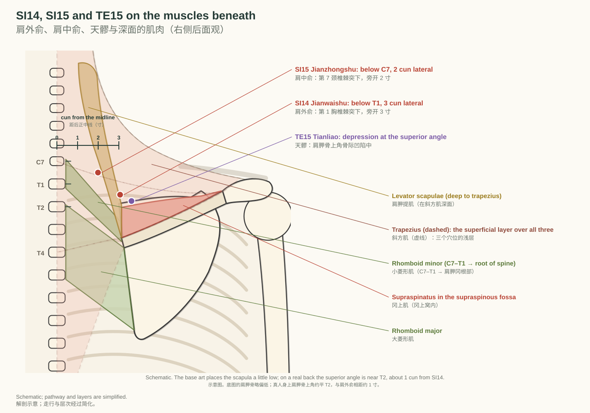
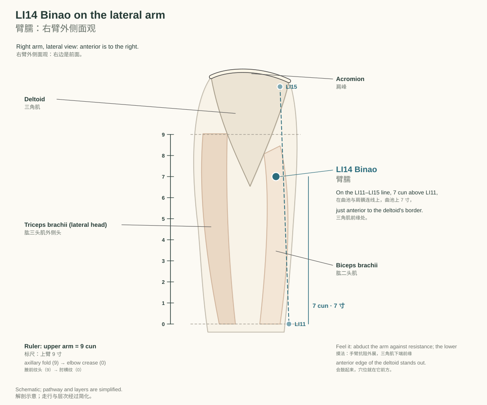
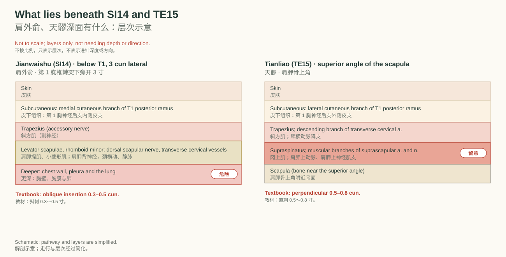
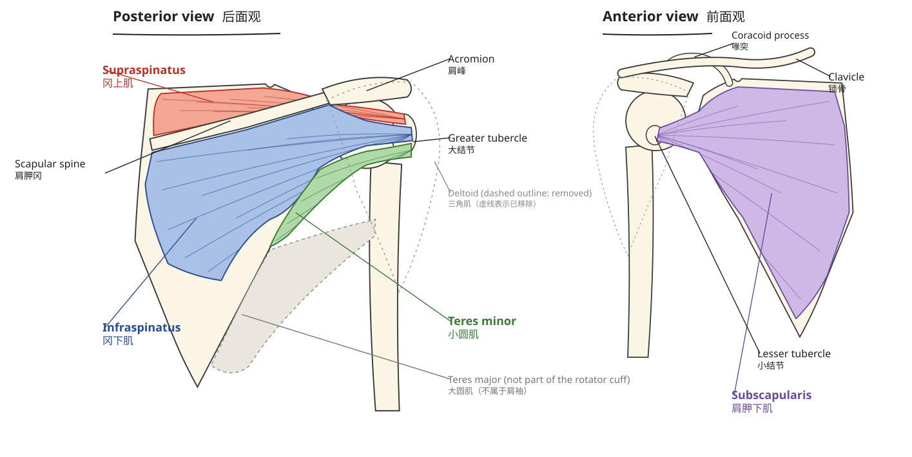

# 第 1 周 周一｜试用版：肩带四穴与肩袖四肌

DPT 基础 · 2026-10-12 · Trial: SI14, SI15, TE15, LI14 · the rotator cuff

## 01 New: four acupoints around the shoulder girdle

新内容：肩带周围的四个穴位

> **After this chapter you can｜读完本章，你能够**
> 1. Locate SI14, SI15, TE15 and LI14 on a back and an arm, using C7, T1, the [scapula](http://127.0.0.1:5178/?term=scapula) and the [deltoid](http://127.0.0.1:5178/?term=deltoid). 用 C7、T1、肩胛骨和三角肌，在背上和臂上找到肩外俞、肩中俞、天髎、臂臑。
> 2. Name the muscle layers under each point and the meridian it belongs to. 说出每个穴位所属的经脉和它下面的肌肉层次。
> 3. Explain why SI14 and SI15 are needled obliquely and shallowly. 解释为什么肩外俞、肩中俞要斜刺、浅刺。
>
> **Key terms｜关键词：** 肩外俞（Jiānwàishū） · 肩中俞（Jiānzhōngshū） · 天髎（Tiānliáo） · 臂臑（Bìnào） · Levator scapulae（肩胛提肌） `li-VAY-ter SKAP-yuh-lee` /lɪˈveɪtər ˈskæpjəˌli/ · Rhomboid minor（小菱形肌） `ROM-boyd MY-ner` /ˈrɑmˌbɔɪd ˈmaɪnər/ · Trapezius（斜方肌） `truh-PEE-zee-uhs` /trəˈpiziəs/ · [Deltoid](http://127.0.0.1:5178/?term=deltoid)（三角肌） `DEL-toyd` /ˈdɛlˌtɔɪd/ · Spinous process（棘突） `SPY-nuhs PRAH-ses` /ˈspaɪnəs ˈprɑsɛs/

Trial pack. This is a trial run of the new weekly model. It is the pack planned for Monday 12 October (week 1, rotator cuff), published early on 9 October so you can test the new format now.

试用版。这是新的周计划模式的试运行，这是第 1 周（肩袖周）周一 10 月 12 日的包，10 月 9 日提前放出来，方便先试新格式。

This week's chapter is the rotator cuff. Today's four new points sit on the muscles around it: SI14 and SI15 on the upper back over levator scapulae and the rhomboids, TE15 at the superior angle of the [scapula](http://127.0.0.1:5178/?term=scapula) over supraspinatus, and LI14 on the lateral arm at the lower end of the [deltoid](http://127.0.0.1:5178/?term=deltoid). All four lie under trapezius or [deltoid](http://127.0.0.1:5178/?term=deltoid), so the first layer you press through is a muscle you already know.

本周章节是肩袖。今天四个新穴位都在它周围的肌肉上：肩外俞、肩中俞在上背部，深面是肩胛提肌和菱形肌；天髎在肩胛骨上角，深面是冈上肌；臂臑在上臂外侧、三角肌下端。四个穴位的浅层都是斜方肌或三角肌，是你已经学过的肌肉。

*Right side, posterior view. Red: small intestine points SI14 and SI15; purple: TE15. The ruler counts cun from the posterior midline to the medial border of the [scapula](http://127.0.0.1:5178/?term=scapula) (3 cun).*  
*右侧后面观。红点为小肠经肩外俞、肩中俞，紫点为三焦经天髎。标尺从后正中线量到肩胛骨内侧缘（3 寸）。*

#### 肩外俞（Jiānwàishū）

- 定位：在背部，第1胸椎棘突下，后正中线旁开3寸（GB/T 12346-2021）
- Location: In the upper back region, at the same level as the inferior border of the spinous process of the first thoracic vertebra (T1), 3 B-cun lateral to the posterior median line. (WHO 2008)
- 层次：皮肤 → 皮下组织（第1胸神经后支内侧皮支）→ 斜方肌（副神经）→ 肩胛提肌、小菱形肌（肩胛背神经；颈横动、静脉）→ 深面胸壁、胸膜与肺
- 安全：深面是胸壁和胸膜、肺尖附近，不可深刺；教材刺法为斜刺 0.3～0.5 寸
- 相关肌肉：斜方肌（浅层）；肩胛提肌、小菱形肌（深层）
- 怎么找：先摸到 C7（低头时最突出的棘突），往下一个是 T1；从 T1 棘突下缘水平向外，到肩胛骨内侧缘（后正中线到肩胛骨内侧缘 = 3 寸）。WHO 注：在肩胛冈内侧端的垂线上，与陶道（GV13）、大杼（BL11）同高（见图 01）

#### 肩中俞（Jiānzhōngshū）

- 定位：在背部，第7颈椎棘突下，后正中线旁开2寸（GB/T 12346-2021）
- Location: In the upper back region, at the same level as the inferior border of the spinous process of the seventh cervical vertebra (C7), 2 B-cun lateral to the posterior median line. (WHO 2008)
- 层次：皮肤 → 皮下组织（第1胸神经后支内侧皮支）→ 斜方肌（副神经）→ 肩胛提肌（肩胛背神经；颈横动、静脉）→ 深面胸壁上口、胸膜顶
- 安全：深面接近胸膜顶和肺尖，不可直刺、深刺；教材刺法为斜刺 0.3～0.5 寸
- 相关肌肉：斜方肌（浅层）；肩胛提肌（深层）
- 怎么找：大椎（GV14，C7 棘突下）水平，向外 2 寸；WHO 注：在后正中线到肩胛骨内侧缘连线的外 1/3 与内 2/3 交点。教材另一取法：大椎与肩井连线的中点（见图 01）

#### 天髎（Tiānliáo）

- 定位：在肩带部，肩胛骨上角骨际凹陷中（GB/T 12346-2021）
- 层次：皮肤 → 皮下组织（第1胸神经后支外侧皮支）→ 斜方肌（副神经；颈横动脉降支）→ 冈上肌（肩胛上动脉、肩胛上神经肌支）→ 肩胛骨上角附近骨面
- 安全：深层有肩胛上动脉和肩胛上神经的肌支；教材刺法为直刺 0.5～0.8 寸。WHO 2008 原文本次没有打开到，英文定位暂缺
- 相关肌肉：斜方肌（浅层）；冈上肌（深层）；肩胛提肌止于肩胛骨上角，就在旁边
- 怎么找：手放到对侧肩上，沿肩胛骨内侧缘往上摸到最高的角（上角），角的上方骨边的凹陷就是天髎；教材：肩井下 1 寸（见图 01）

#### 臂臑（Bìnào）

- 定位：在臂外侧，在曲池（LI11）与肩髃（LI15）连线上，三角肌前缘处（GB/T 12346-2021）
- Location: On the lateral aspect of the arm, just anterior to the border of the [deltoid](http://127.0.0.1:5178/?term=deltoid) muscle, 7 B-cun superior to LI11. (WHO 2008)
- 层次：皮肤 → 皮下组织（前臂后皮神经等，教材）→ 三角肌下端前缘（腋神经）→ 深层有桡神经本干（教材）
- 安全：深层有桡神经（教材），不要反复强刺；教材刺法为直刺或向上斜刺 0.5～1.5 寸
- 相关肌肉：三角肌（下端前缘）；肱二头肌在其前方
- 怎么找：手臂抗阻外展，三角肌下端的前缘鼓起来，在曲池与肩髃的连线上、曲池上 7 寸处（见图 02）

### How to find them｜怎么找

Start from C7, the most prominent spinous process when the head is bent forward. SI15 is level with the lower border of C7, 2 cun out. Count one process down to T1: SI14 is level with its lower border, 3 cun out, which puts it on the vertical line through the medial end of the scapular spine. Then follow the medial border of the [scapula](http://127.0.0.1:5178/?term=scapula) up to its highest corner, the superior angle: TE15 sits in the depression just above that bone edge.

从 C7 开始：低头时最突出的棘突。肩中俞与 C7 棘突下缘同高，旁开 2 寸。往下数一个是 T1：肩外俞与 T1 棘突下缘同高，旁开 3 寸，正好在肩胛冈内侧端的垂线上。再沿肩胛骨内侧缘往上摸到最高的角（上角），天髎就在这个骨边上方的凹陷里。

*Right arm, lateral view. LI14 lies on the line from LI11 to LI15, 7 cun above LI11, just in front of the lower [deltoid](http://127.0.0.1:5178/?term=deltoid) border.*  
*右臂外侧面观。臂臑在曲池与肩髃的连线上，曲池上 7 寸，紧贴三角肌下端前缘。*

**易混点：** 臂臑的定位有三种写法：GB/T 12346-2021 写「曲池与肩髃连线上，三角肌前缘处」，没有写 7 寸；WHO 2008 写「三角肌前缘稍前，曲池上 7 寸」；《针灸学》教材写「曲池上 7 寸，当三角肌下端」。考试以国标为准，找穴时三条可以一起用：先量 7 寸，再找三角肌下端的前缘。

### What lies beneath｜深面有什么

*Layers under SI14 and TE15, simplified from the textbook anatomy. Not to scale and not a needling depth or direction.*  
*肩外俞、天髎的层次，按教材解剖简化。不按比例，不表示进针深度或方向。*

Under SI14 and SI15, trapezius is the superficial layer and levator scapulae (with rhomboid minor at SI14) the deep one; the dorsal scapular nerve and the transverse cervical vessels run here. Deeper still are the chest wall and the pleura near the apex of the lung, which is why the textbook needles both points obliquely, 0.3–0.5 cun. At TE15 the deep muscle is supraspinatus, with muscular branches of the suprascapular artery and nerve.

肩外俞、肩中俞的浅层是斜方肌，深层是肩胛提肌（肩外俞还有小菱形肌），这里走着肩胛背神经和颈横动、静脉。再往深是胸壁和肺尖附近的胸膜，所以教材两穴都是斜刺 0.3～0.5 寸。天髎深层是冈上肌，有肩胛上动脉和肩胛上神经的肌支。

Link to the chapter: TE15 sits over supraspinatus, the cuff muscle that starts abduction, and LI14 sits at the lower end of [deltoid](http://127.0.0.1:5178/?term=deltoid), its force-couple partner. When you palpate these points, you are touching the two muscles that lift the arm together.

和本章的联系：天髎深面是冈上肌，也就是启动外展的那块肩袖肌；臂臑在三角肌下端，三角肌是它的力偶搭档。摸这两个穴位时，摸到的正是一起抬起手臂的两块肌肉。

#### Check yourself｜先自测

**Q.** Where is SI14 by GB/T 12346-2021, and how do you find T1? 按 GB/T 12346-2021，肩外俞在哪里？怎么找到 T1？

Answer 答案

Below the T1 spinous process, 3 cun lateral to the posterior midline. Find C7 (most prominent when the head is bent forward) and count one process down. 第 1 胸椎棘突下，后正中线旁开 3 寸。先找低头时最突出的 C7，往下数一个就是 T1。

**Q.** Which muscles lie under SI15, and why is it needled obliquely? 肩中俞深面是哪些肌肉？为什么要斜刺？

Answer 答案

Trapezius, then levator scapulae; deeper are the pleura and the apex of the lung, so the textbook needles it obliquely, 0.3–0.5 cun. 斜方肌，再深是肩胛提肌；更深是胸膜顶和肺尖，所以教材斜刺 0.3～0.5 寸。

**Q.** Which meridian does TE15 belong to, and which rotator cuff muscle lies beneath it? 天髎属于哪条经？深面是哪块肩袖肌？

Answer 答案

The hand shaoyang triple energizer meridian; supraspinatus lies deep to trapezius there. 手少阳三焦经；斜方肌深面是冈上肌。

**Q.** How far above LI11 is LI14, and which muscle border marks it? 臂臑在曲池上几寸？以哪块肌肉的边缘为标志？

Answer 答案

7 cun above LI11 (WHO, textbook), at the anterior border of the [deltoid](http://127.0.0.1:5178/?term=deltoid) near its lower end. 曲池上 7 寸（WHO、教材），三角肌下端的前缘。

> **Take-home 本章要点：** SI15 below C7 at 2 cun, SI14 below T1 at 3 cun, TE15 at the superior angle, LI14 at the lower front edge of [deltoid](http://127.0.0.1:5178/?term=deltoid).  
> 肩中俞：C7 下旁开 2 寸；肩外俞：T1 下旁开 3 寸；天髎：肩胛骨上角；臂臑：三角肌下端前缘。

## 02 Consolidate: the four rotator cuff muscles

夯实：肩袖四肌

> **After this chapter you can｜读完本章，你能够**
> 1. Say origin, insertion, nerve (with segments) and action of each cuff muscle without looking. 不看书说出每块肩袖肌的起点、止点、神经（带节段）和动作。
> 2. Say the course sentence for each muscle in English. 用英文说出每块肌肉的走行句。
>
> **Key terms｜关键词：** Supraspinatus（冈上肌） `soo-pruh-spy-NAY-tuhs` /ˌsuprəˌspaɪˈneɪtəs/ · Infraspinatus（冈下肌） `in-fruh-spy-NAY-tuhs` /ˌɪnfrəspaɪˈneɪtəs/ · Teres minor（小圆肌） `TEER-eez MY-ner` /ˈtɪriz ˈmaɪnər/ · Subscapularis（肩胛下肌） `sub-skap-yuh-LAIR-uhs` /ˌsʌbˌskæpjəˈlɛrəs/ · [Greater tubercle](http://127.0.0.1:5178/?term=greater-tubercle)（大结节） `GRAY-ter TOO-ber-kuhl` /ˈɡreɪtər ˈtubərkəl/ · [Lesser tubercle](http://127.0.0.1:5178/?term=lesser-tubercle)（小结节） `LES-er TOO-ber-kuhl` /ˈlɛsər ˈtubərkəl/ · Suprascapular nerve（肩胛上神经） `soo-pruh-SKAP-yuh-ler NURV` /ˌsuprəˈskæpjələr nɝv/ · Axillary nerve（腋神经） `AK-suh-lair-ee NURV` /ˈæksəˌlɛri nɝv/

These facts come straight from this week's chapter (library: shoulder). First answer the questions, then run the flashcards: the deck mixes today's four new points with the four cuff muscles.

这些内容直接取自本周章节（知识库：肩部）。先答题，再刷记忆卡：卡组把今天的四个新穴位和四块肩袖肌混在一起。

*From the shoulder chapter: right shoulder, posterior and anterior views with the four cuff muscles.*  
*取自肩部章节：右肩后面观和前面观，标出四块肩袖肌。*

| Muscle 肌肉 | Insertion 止点 | Nerve 神经 | Action 动作 |
|---|---|---|---|
| Supraspinatus 冈上肌 | Superior facet of the [greater tubercle](http://127.0.0.1:5178/?term=greater-tubercle) of the [humerus](http://127.0.0.1:5178/?term=humerus) 肱骨大结节上小面 | Suprascapular nerve (usually C5–C6) 肩胛上神经（通常为 C5–C6） | It contributes to shoulder abduction and helps stabilize the [humeral head](http://127.0.0.1:5178/?term=humeral-head) in the glenoid cavity. 它参与肩关节外展，并帮助将肱骨头稳定在关节盂内。 |
| Infraspinatus 冈下肌 | Middle facet of the [greater tubercle](http://127.0.0.1:5178/?term=greater-tubercle) of the [humerus](http://127.0.0.1:5178/?term=humerus) 肱骨大结节中小面 | Suprascapular nerve (usually C5–C6) 肩胛上神经（通常为 C5–C6） | It externally rotates the [humerus](http://127.0.0.1:5178/?term=humerus) and contributes to dynamic stability of the glenohumeral joint. 它使肱骨外旋，并参与盂肱关节的动态稳定。 |
| Teres minor 小圆肌 | Inferior facet of the [greater tubercle](http://127.0.0.1:5178/?term=greater-tubercle) of the [humerus](http://127.0.0.1:5178/?term=humerus) 肱骨大结节下小面 | Axillary nerve (mainly C5–C6) 腋神经（主要为 C5–C6） | It assists external rotation of the [humerus](http://127.0.0.1:5178/?term=humerus) and helps stabilize the [humeral head](http://127.0.0.1:5178/?term=humeral-head). Teres major is a separate muscle and is not part of the rotator cuff. 它协助肱骨外旋并帮助稳定肱骨头。大圆肌是另一块肌肉，不属于肩袖。 |
| Subscapularis 肩胛下肌 | [Lesser tubercle](http://127.0.0.1:5178/?term=lesser-tubercle) of the [humerus](http://127.0.0.1:5178/?term=humerus) 肱骨小结节 | Upper and lower subscapular nerves (C5–C6; some sources include C7) 上、下肩胛下神经（C5–C6；部分资料还包括 C7） | It internally rotates the [humerus](http://127.0.0.1:5178/?term=humerus) and contributes to anterior stability of the glenohumeral joint. 它使肱骨内旋，并参与盂肱关节前方的稳定。 |

### Self-test｜自测

#### Check yourself｜先自测

**Q.** Supraspinatus inserts onto which facet of the [greater tubercle](http://127.0.0.1:5178/?term=greater-tubercle)? 冈上肌止于大结节的哪一个小面？

Answer 答案

The superior facet. 上小面。

**Q.** Infraspinatus and teres minor both externally rotate the [humerus](http://127.0.0.1:5178/?term=humerus). Which nerve supplies each? 冈下肌和小圆肌都外旋肱骨，各由什么神经支配？

Answer 答案

Infraspinatus: suprascapular nerve (usually C5–C6). Teres minor: axillary nerve (mainly C5–C6). 冈下肌：肩胛上神经（通常 C5–C6）；小圆肌：腋神经（主要 C5–C6）。

**Q.** Which cuff muscle inserts on the [lesser tubercle](http://127.0.0.1:5178/?term=lesser-tubercle), and what is its main action? 哪块肩袖肌止于小结节？主要动作是什么？

Answer 答案

Subscapularis; internal rotation of the [humerus](http://127.0.0.1:5178/?term=humerus). 肩胛下肌；使肱骨内旋。

**Q.** Is teres major part of the rotator cuff? 大圆肌属于肩袖吗？

Answer 答案

No. Teres major is a separate muscle. 不属于，大圆肌是另一块肌肉。

**Q.** Fill in: The infraspinatus originates from the ____ fossa, passes behind the glenohumeral joint, and inserts onto the ____ facet of the [greater tubercle](http://127.0.0.1:5178/?term=greater-tubercle). 填空：冈下肌起自____窝，经盂肱关节后方，止于大结节____小面。

Answer 答案

Infraspinous; middle. 冈下窝；中。

**Q.** Look at figure 04: name the three muscles on the posterior view from top to bottom. 看图 04：后面观从上到下是哪三块肌肉？

Answer 答案

Supraspinatus, infraspinatus, teres minor. 冈上肌、冈下肌、小圆肌。

**Q.** Which of today's new acupoints lies over a rotator cuff muscle, and which muscle? 今天的新穴位里，哪一个的深面是肩袖肌？是哪块？

Answer 答案

TE15 Tianliao; supraspinatus lies deep to trapezius there. 天髎；斜方肌深面是冈上肌。

**Q.** Which spinal segments do all four cuff muscles share? 四块肩袖肌共同的脊髓节段是什么？

Answer 答案

C5–C6 (subscapularis: some sources include C7). C5–C6（肩胛下肌部分资料还包括 C7）。

### Flashcards｜记忆卡

- **肩外俞 Jiānwàishū**（定位？层次？）→ Below T1 spinous process, 3 cun lateral to the posterior midline 在背部，第1胸椎棘突下，后正中线旁开3寸（GB/T 12346-2021）。层次：皮肤 → 皮下组织（第1胸神经后支内侧皮支）→ 斜方肌（副神经）→ 肩胛提肌、小菱形肌（肩胛背神经；颈横动、静脉）→ 深面胸壁、胸膜与肺
- **肩中俞 Jiānzhōngshū**（定位？层次？）→ Below C7 spinous process, 2 cun lateral to the posterior midline 在背部，第7颈椎棘突下，后正中线旁开2寸（GB/T 12346-2021）。层次：皮肤 → 皮下组织（第1胸神经后支内侧皮支）→ 斜方肌（副神经）→ 肩胛提肌（肩胛背神经；颈横动、静脉）→ 深面胸壁上口、胸膜顶
- **天髎 Tiānliáo**（定位？层次？）→ In the depression at the superior angle of the [scapula](http://127.0.0.1:5178/?term=scapula) 在肩带部，肩胛骨上角骨际凹陷中（GB/T 12346-2021）。层次：皮肤 → 皮下组织（第1胸神经后支外侧皮支）→ 斜方肌（副神经；颈横动脉降支）→ 冈上肌（肩胛上动脉、肩胛上神经肌支）→ 肩胛骨上角附近骨面
- **臂臑 Bìnào**（定位？层次？）→ Lateral arm on the LI11–LI15 line, 7 cun above LI11, just anterior to the [deltoid](http://127.0.0.1:5178/?term=deltoid) border 在臂外侧，在曲池（LI11）与肩髃（LI15）连线上，三角肌前缘处（GB/T 12346-2021）。层次：皮肤 → 皮下组织（前臂后皮神经等，教材）→ 三角肌下端前缘（腋神经）→ 深层有桡神经本干（教材）
- **Supraspinatus**（冈上肌）→ The supraspinatus originates from the supraspinous fossa of the [scapula](http://127.0.0.1:5178/?term=scapula), passes laterally beneath the [acromion](http://127.0.0.1:5178/?term=acromion) as a tendon, and inserts onto the superior facet of the [greater tubercle](http://127.0.0.1:5178/?term=greater-tubercle) of the [humerus](http://127.0.0.1:5178/?term=humerus). 神经：肩胛上神经（通常为 C5–C6）；动作：它参与肩关节外展，并帮助将肱骨头稳定在关节盂内。
- **Infraspinatus**（冈下肌）→ The infraspinatus originates from the infraspinous fossa of the [scapula](http://127.0.0.1:5178/?term=scapula), passes laterally behind the glenohumeral joint as its fibers converge into a tendon, and inserts onto the middle facet of the [greater tubercle](http://127.0.0.1:5178/?term=greater-tubercle) of the [humerus](http://127.0.0.1:5178/?term=humerus). 神经：肩胛上神经（通常为 C5–C6）；动作：它使肱骨外旋，并参与盂肱关节的动态稳定。
- **Teres minor**（小圆肌）→ The teres minor originates from the upper part of the lateral border of the [scapula](http://127.0.0.1:5178/?term=scapula), passes superolaterally along the inferior border of the infraspinatus, and inserts onto the inferior facet of the [greater tubercle](http://127.0.0.1:5178/?term=greater-tubercle) of the [humerus](http://127.0.0.1:5178/?term=humerus). 神经：腋神经（主要为 C5–C6）；动作：它协助肱骨外旋并帮助稳定肱骨头。大圆肌是另一块肌肉，不属于肩袖。
- **Subscapularis**（肩胛下肌）→ The subscapularis originates from the subscapular fossa on the anterior surface of the [scapula](http://127.0.0.1:5178/?term=scapula), passes laterally in front of the glenohumeral joint, and inserts onto the [lesser tubercle](http://127.0.0.1:5178/?term=lesser-tubercle) of the [humerus](http://127.0.0.1:5178/?term=humerus). 神经：上、下肩胛下神经（C5–C6；部分资料还包括 C7）；动作：它使肱骨内旋，并参与盂肱关节前方的稳定。
- **The rotator cuff: S I T S**（肩袖四肌：S I T S）→ Supraspinatus, Infraspinatus, Teres minor, Subscapularis 冈上肌、冈下肌、小圆肌、肩胛下肌
- **[Greater tubercle](http://127.0.0.1:5178/?term=greater-tubercle): superior, middle, inferior facets**（大结节的上、中、下三个小面）→ Supraspinatus, infraspinatus, teres minor (top to bottom) 从上到下：冈上肌、冈下肌、小圆肌

**Sources 来源：** [GB/T 12346-2021 经穴名称与定位](https://zynj.shutcm.edu.cn/_upload/article/files/66/b4/b34a95604d04b0bf686251b2d317/368ea8b0-187c-48a7-a402-ffdf1e11bb99.pdf) · [WHO Standard Acupuncture Point Locations (2008)](https://medbox.org/dl/627a4de115110145a1723f64) · [《针灸学》肩外俞](https://www.gmzyjx.com/books/zjs/zjs-zjs3.1.4-6-0.0.3.3.14/) · [《针灸学》肩中俞](https://www.gmzyjx.com/books/zjs/zjs-zjs3.1.4-6-0.0.3.3.15/) · [《针灸学》天髎](https://www.gmzyjx.com/books/zjs/zjs-zjs3.1.9-12-0.0.2.3.15/) · [《针灸学》臂臑](https://www.gmzyjx.com/books/zjs/zjs-zjs3.1.1-3-0.1.2.3.14/) · [StatPearls: Infraspinatus](https://www.ncbi.nlm.nih.gov/books/NBK513255/) · [StatPearls: Teres minor](https://www.ncbi.nlm.nih.gov/books/NBK513324/) · [StatPearls: Subscapularis](https://www.ncbi.nlm.nih.gov/books/NBK513344/) · [StatPearls: Suprascapular nerve](https://www.ncbi.nlm.nih.gov/books/NBK557880/) · 肌肉内容取自 library/shoulder/content.json；穴位定位依据 GB/T 12346-2021 与 WHO 2008，层次与刺法依据《针灸学》教材

> **Take-home 本章要点：** Three on the [greater tubercle](http://127.0.0.1:5178/?term=greater-tubercle) (S, I, T: top to bottom), one on the lesser (subscapularis); all C5–C6.  
> 三块止于大结节（冈上、冈下、小圆，从上到下），一块止于小结节（肩胛下肌）；都是 C5–C6。

---

DPT 每日包 · 提前试用版（第 1 周周一 10-12 的内容，10-09 先放出来试）· 定位依据 GB/T 12346-2021 与 WHO 2008；层次为学习用的简化描述，不代表进针方向或深度。
