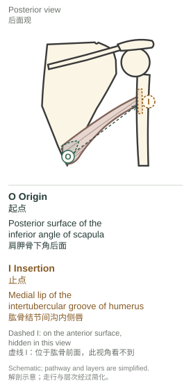
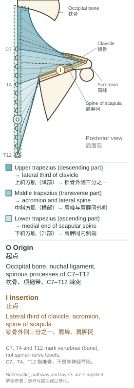

# Rotator cuff｜肩袖

From anatomy to clinical application · 从解剖到临床应用

Location → innervation → movement → application → review · 位置 → 支配 → 动作 → 应用 → 复习

## 01 Anatomy: the four [rotator cuff](http://127.0.0.1:5178/?term=rotator-cuff) muscles｜解剖基础：肩袖的四块肌肉

The [rotator cuff](http://127.0.0.1:5178/?term=rotator-cuff) consists of the [supraspinatus](http://127.0.0.1:5178/?term=supraspinatus), [infraspinatus](http://127.0.0.1:5178/?term=infraspinatus), [teres minor](http://127.0.0.1:5178/?term=teres-minor), and [subscapularis](http://127.0.0.1:5178/?term=subscapularis). These muscles connect the [scapula](http://127.0.0.1:5178/?term=scapula) to the proximal [humerus](http://127.0.0.1:5178/?term=humerus) and help stabilize the [humeral head](http://127.0.0.1:5178/?term=humeral-head) in the glenoid cavity.

肩袖由冈上肌、冈下肌、小圆肌和肩胛下肌组成。这些肌肉连接肩胛骨与肱骨近端，并帮助将肱骨头稳定在关节盂内。

Posterior and anterior views of the right shoulder: muscles and bony landmarks.  
右肩后面观与前面观：肌肉和骨性标志。

### Origins, insertions, and anatomical course｜起点、止点与解剖走行

O = origin; I = insertion. The dashed O → I line follows the attachment sequence. It is separate from the force arrows used in the movement diagrams.

O 表示起点，I 表示止点。虚线 O → I 表示从起点到止点的附着顺序，与动作图中的受力箭头分开。

### [Supraspinatus](http://127.0.0.1:5178/?term=supraspinatus)｜冈上肌 `soo-pruh-spy-NAY-tuhs`

**Origin（起点）:** [Supraspinous fossa](http://127.0.0.1:5178/?term=supraspinous-fossa) of the [scapula](http://127.0.0.1:5178/?term=scapula)  
肩胛骨冈上窝

**Insertion（止点）:** Superior facet of the [greater tubercle](http://127.0.0.1:5178/?term=greater-tubercle) of the [humerus](http://127.0.0.1:5178/?term=humerus)  
肱骨大结节上小面

**Innervation（神经支配）:** Suprascapular nerve (usually C5–C6)  
肩胛上神经（通常为 C5–C6）

The [supraspinatus](http://127.0.0.1:5178/?term=supraspinatus) originates from the [supraspinous fossa](http://127.0.0.1:5178/?term=supraspinous-fossa) of the [scapula](http://127.0.0.1:5178/?term=scapula), passes laterally beneath the [acromion](http://127.0.0.1:5178/?term=acromion) as a tendon, and inserts onto the superior facet of the [greater tubercle](http://127.0.0.1:5178/?term=greater-tubercle) of the [humerus](http://127.0.0.1:5178/?term=humerus).

冈上肌起自肩胛骨冈上窝，以肌腱向外侧经肩峰下方走行，止于肱骨大结节上小面。

It contributes to shoulder abduction and helps stabilize the [humeral head](http://127.0.0.1:5178/?term=humeral-head) in the glenoid cavity.

它参与肩关节外展，并帮助将肱骨头稳定在关节盂内。

[Explore in 3D · 三维查看](http://127.0.0.1:5178/?term=supraspinatus) · Anatomy source · 解剖依据: [Elsevier anatomy resource: Supraspinatus muscle](https://www.elsevier.com/resources/anatomy/muscular-system/muscles-of-upper-limb/supraspinatus-muscle/21166) · [NCBI Bookshelf (StatPearls): Anatomy, Shoulder and Upper Limb, Arm Abductor Muscles](https://www.ncbi.nlm.nih.gov/books/NBK537148/) · [NCBI Bookshelf (StatPearls): Anatomy, Shoulder and Upper Limb, Suprascapular Nerve](https://www.ncbi.nlm.nih.gov/books/NBK557880/)

### [Infraspinatus](http://127.0.0.1:5178/?term=infraspinatus)｜冈下肌 `in-fruh-spy-NAY-tuhs`

**Origin（起点）:** [Infraspinous fossa](http://127.0.0.1:5178/?term=infraspinous-fossa) of the [scapula](http://127.0.0.1:5178/?term=scapula)  
肩胛骨冈下窝

**Insertion（止点）:** Middle facet of the [greater tubercle](http://127.0.0.1:5178/?term=greater-tubercle) of the [humerus](http://127.0.0.1:5178/?term=humerus)  
肱骨大结节中小面

**Innervation（神经支配）:** Suprascapular nerve (usually C5–C6)  
肩胛上神经（通常为 C5–C6）

The [infraspinatus](http://127.0.0.1:5178/?term=infraspinatus) originates from the [infraspinous fossa](http://127.0.0.1:5178/?term=infraspinous-fossa) of the [scapula](http://127.0.0.1:5178/?term=scapula), passes laterally behind the glenohumeral joint as its fibers converge into a tendon, and inserts onto the middle facet of the [greater tubercle](http://127.0.0.1:5178/?term=greater-tubercle) of the [humerus](http://127.0.0.1:5178/?term=humerus).

冈下肌起自肩胛骨冈下窝，肌纤维汇聚成肌腱，向外侧经盂肱关节后方走行，止于肱骨大结节中小面。

It externally rotates the [humerus](http://127.0.0.1:5178/?term=humerus) and contributes to dynamic stability of the glenohumeral joint.

它使肱骨外旋，并参与盂肱关节的动态稳定。

[Explore in 3D · 三维查看](http://127.0.0.1:5178/?term=infraspinatus) · Anatomy source · 解剖依据: [Elsevier anatomy resource: Infraspinatus muscle](https://www.elsevier.com/resources/anatomy/muscular-system/muscles-of-upper-limb/infraspinatus-muscle/20380) · [NCBI Bookshelf (StatPearls): Anatomy, Shoulder and Upper Limb, Infraspinatus Muscle](https://www.ncbi.nlm.nih.gov/books/NBK513255/) · [NCBI Bookshelf (StatPearls): Anatomy, Shoulder and Upper Limb, Suprascapular Nerve](https://www.ncbi.nlm.nih.gov/books/NBK557880/)

### [Teres minor](http://127.0.0.1:5178/?term=teres-minor)｜小圆肌 `TEER-eez MY-ner`

**Origin（起点）:** Upper part of the lateral border of the scapula  
肩胛骨外侧缘上部

**Insertion（止点）:** Inferior facet of the [greater tubercle](http://127.0.0.1:5178/?term=greater-tubercle) of the [humerus](http://127.0.0.1:5178/?term=humerus)  
肱骨大结节下小面

**Innervation（神经支配）:** Axillary nerve (mainly C5–C6)  
腋神经（主要为 C5–C6）

The [teres minor](http://127.0.0.1:5178/?term=teres-minor) originates from the upper part of the lateral border of the scapula, passes superolaterally along the inferior border of the [infraspinatus](http://127.0.0.1:5178/?term=infraspinatus), and inserts onto the inferior facet of the [greater tubercle](http://127.0.0.1:5178/?term=greater-tubercle) of the [humerus](http://127.0.0.1:5178/?term=humerus).

小圆肌起自肩胛骨外侧缘上部，沿冈下肌下缘向上外侧走行，止于肱骨大结节下小面。

It assists external rotation of the [humerus](http://127.0.0.1:5178/?term=humerus) and helps stabilize the [humeral head](http://127.0.0.1:5178/?term=humeral-head). [Teres major](http://127.0.0.1:5178/?term=teres-major) is a separate muscle and is not part of the [rotator cuff](http://127.0.0.1:5178/?term=rotator-cuff).

它协助肱骨外旋并帮助稳定肱骨头。大圆肌是另一块肌肉，不属于肩袖。

[Explore in 3D · 三维查看](http://127.0.0.1:5178/?term=teres-minor) · Anatomy source · 解剖依据: [Elsevier anatomy resource: Teres minor muscle](https://www.elsevier.com/resources/anatomy/muscular-system/muscles-of-upper-limb/teres-minor-muscle/19335) · [NCBI Bookshelf (StatPearls): Anatomy, Shoulder and Upper Limb, Teres Minor Muscle](https://www.ncbi.nlm.nih.gov/books/NBK513324/)

### [Subscapularis](http://127.0.0.1:5178/?term=subscapularis)｜肩胛下肌 `sub-skap-yuh-LAIR-uhs`

**Origin（起点）:** Subscapular fossa on the anterior surface of the [scapula](http://127.0.0.1:5178/?term=scapula)  
肩胛骨前面的肩胛下窝

**Insertion（止点）:** [Lesser tubercle](http://127.0.0.1:5178/?term=lesser-tubercle) of the [humerus](http://127.0.0.1:5178/?term=humerus)  
肱骨小结节

**Innervation（神经支配）:** Upper and lower subscapular nerves (C5–C6; some sources include C7)  
上、下肩胛下神经（C5–C6；部分资料还包括 C7）

The [subscapularis](http://127.0.0.1:5178/?term=subscapularis) originates from the subscapular fossa on the anterior surface of the [scapula](http://127.0.0.1:5178/?term=scapula), passes laterally in front of the glenohumeral joint, and inserts onto the [lesser tubercle](http://127.0.0.1:5178/?term=lesser-tubercle) of the [humerus](http://127.0.0.1:5178/?term=humerus).

肩胛下肌起自肩胛骨前面的肩胛下窝，经盂肱关节前方向外侧走行，止于肱骨小结节。

It internally rotates the [humerus](http://127.0.0.1:5178/?term=humerus) and contributes to anterior stability of the glenohumeral joint.

它使肱骨内旋，并参与盂肱关节前方的稳定。

[Explore in 3D · 三维查看](http://127.0.0.1:5178/?term=subscapularis) · Anatomy source · 解剖依据: [Elsevier anatomy resource: Subscapularis muscle](https://www.elsevier.com/resources/anatomy/muscular-system/muscles-of-upper-limb/subscapularis-muscle/16597) · [NCBI Bookshelf (StatPearls): Anatomy, Shoulder and Upper Limb, Subscapularis Muscle](https://www.ncbi.nlm.nih.gov/books/NBK513344/) · [Kenhub: Subscapularis: Origin, insertion, action, innervation](https://www.kenhub.com/en/library/anatomy/subscapularis-muscle)

### Two neighboring muscles that are not part of the [rotator cuff](http://127.0.0.1:5178/?term=rotator-cuff)｜两块不属于肩袖的相邻肌肉

### [Teres major](http://127.0.0.1:5178/?term=teres-major)｜大圆肌 `TEER-eez MAY-jer`

**Origin（起点）:** Posterior surface of the [inferior angle of the scapula](http://127.0.0.1:5178/?term=inferior-angle)  
肩胛骨下角后面

**Insertion（止点）:** Medial lip of the intertubercular groove (crest of the [lesser tubercle](http://127.0.0.1:5178/?term=lesser-tubercle)) of the [humerus](http://127.0.0.1:5178/?term=humerus)  
肱骨结节间沟内侧唇（小结节嵴）

**Innervation（神经支配）:** Lower subscapular nerve, from the posterior cord of the brachial plexus (usually C5–C6; some sources include C7)  
下肩胛下神经，发自臂丛后束（通常为 C5–C6，部分资料含 C7）

The [teres major](http://127.0.0.1:5178/?term=teres-major) originates from the posterior surface of the [inferior angle of the scapula](http://127.0.0.1:5178/?term=inferior-angle), passes superolaterally below the [teres minor](http://127.0.0.1:5178/?term=teres-minor) and anterior to the [long head of the triceps brachii](http://127.0.0.1:5178/?term=triceps-long-head), and inserts onto the medial lip of the intertubercular groove of the [humerus](http://127.0.0.1:5178/?term=humerus).

大圆肌起自肩胛骨下角后面，在小圆肌下方、肱三头肌长头前方向上外侧走行，止于肱骨结节间沟内侧唇。

It adducts and medially rotates the arm at the glenohumeral joint and helps extend the arm from a flexed position. [Teres major](http://127.0.0.1:5178/?term=teres-major) is not part of the [rotator cuff](http://127.0.0.1:5178/?term=rotator-cuff); it forms the inferior border of the quadrangular space.

它在盂肱关节使上臂内收和内旋，并协助上臂从屈曲位伸展。大圆肌不属于肩袖；它构成四边孔的下界。

[Explore in 3D · 三维查看](http://127.0.0.1:5178/?term=teres-major) · Anatomy source · 解剖依据: [Elsevier anatomy resource (Complete Anatomy): Teres major muscle](https://www.elsevier.com/resources/anatomy/muscular-system/muscles-of-upper-limb/teres-major-muscle/17190) · [Kenhub: Teres major muscle: Anatomy, function, clinical aspects](https://www.kenhub.com/en/library/anatomy/teres-major-muscle) · [TeachMeAnatomy: The Intrinsic Muscles of the Shoulder](https://teachmeanatomy.info/upper-limb/muscles/shoulder/intrinsic/) · [NCBI Bookshelf (StatPearls): Anatomy, Shoulder and Upper Limb, Subscapularis Muscle](https://www.ncbi.nlm.nih.gov/books/NBK513344/) · [TeachMeAnatomy: Quadrangular Space - Borders - Contents](https://teachmeanatomy.info/upper-limb/areas/quadrangular-space/)

### [Trapezius](http://127.0.0.1:5178/?term=trapezius)｜斜方肌 `truh-PEE-zee-uhs`

**Origin（起点）:** External occipital protuberance and medial third of the superior nuchal line of the occipital bone, the nuchal ligament, and the spinous processes of the C7–T12 vertebrae  
枕骨的枕外隆凸和上项线内侧三分之一、项韧带，以及 C7–T12 椎骨棘突

**Insertion（止点）:** Posterior border of the lateral third of the [clavicle](http://127.0.0.1:5178/?term=clavicle), the medial margin of the [acromion](http://127.0.0.1:5178/?term=acromion), and the superior lip of the [spine of the scapula](http://127.0.0.1:5178/?term=scapular-spine) as far as the tubercle at its medial end  
锁骨外侧三分之一后缘、肩峰内侧缘，以及肩胛冈上唇直至其内侧端的结节

**Innervation（神经支配）:** Spinal accessory nerve (cranial nerve XI) for motor supply; anterior rami of the C3 and C4 spinal nerves through the cervical plexus, usually described as proprioceptive (sensory), although a cadaveric study found motor axons in these branches  
副神经（第十一对脑神经）提供运动支配；C3、C4 脊神经前支经颈丛加入，通常被描述为本体感觉（感觉）纤维，但一项尸体研究在这些分支中发现了运动轴突

The [trapezius](http://127.0.0.1:5178/?term=trapezius) originates from the occipital bone, the nuchal ligament and the spinous processes of the C7–T12 vertebrae, passes laterally as its fibers converge on the shoulder, and inserts onto the lateral third of the [clavicle](http://127.0.0.1:5178/?term=clavicle), the [acromion](http://127.0.0.1:5178/?term=acromion) and the [spine of the scapula](http://127.0.0.1:5178/?term=scapular-spine). The [upper trapezius](http://127.0.0.1:5178/?term=upper-trapezius) (descending part) runs inferolaterally to the [clavicle](http://127.0.0.1:5178/?term=clavicle), the [middle trapezius](http://127.0.0.1:5178/?term=middle-trapezius) (transverse part) runs horizontally to the [acromion](http://127.0.0.1:5178/?term=acromion) and the lateral part of the [scapular spine](http://127.0.0.1:5178/?term=scapular-spine), and the [lower trapezius](http://127.0.0.1:5178/?term=lower-trapezius) (ascending part) runs superolaterally to the medial end of the [scapular spine](http://127.0.0.1:5178/?term=scapular-spine). The vertebral levels at which the parts divide differ between sources.

斜方肌起自枕骨、项韧带和 C7–T12 椎骨棘突，肌纤维向肩部汇聚并向外侧走行，止于锁骨外侧三分之一、肩峰和肩胛冈。上斜方肌（降部）向下外侧走向锁骨，中斜方肌（横部）水平走向肩峰和肩胛冈外侧部，下斜方肌（升部）向上外侧走向肩胛冈内侧端。各部分界的椎骨节段在不同资料中略有出入。

The upper part elevates the [scapula](http://127.0.0.1:5178/?term=scapula), the middle part retracts it, and the lower part depresses its medial part. The upper and lower parts work with [serratus anterior](http://127.0.0.1:5178/?term=serratus-anterior) to rotate the [scapula](http://127.0.0.1:5178/?term=scapula) upward during arm elevation. With the [scapula](http://127.0.0.1:5178/?term=scapula) fixed, the upper part extends and laterally flexes the neck.

上部上提肩胛骨，中部使肩胛骨后缩，下部使肩胛骨内侧部下降。上部和下部与前锯肌协作，在手臂上举时使肩胛骨上旋。肩胛骨固定时，上部可使颈部后伸并侧屈。

[Explore in 3D · 三维查看](http://127.0.0.1:5178/?term=trapezius) · Anatomy source · 解剖依据: [Kenhub: Trapezius muscle: Anatomy, origins, insertions, actions](https://www.kenhub.com/en/library/anatomy/trapezius-muscle) · [NCBI Bookshelf (StatPearls): Anatomy, Back, Trapezius](https://www.ncbi.nlm.nih.gov/books/NBK518994/) · [Elsevier anatomy resource (Complete Anatomy): Descending part of trapezius muscle](https://www.elsevier.com/resources/anatomy/muscular-system/muscles-of-back/descending-part-of-trapezius-muscle/20351) · [Elsevier anatomy resource (Complete Anatomy): Transverse part of trapezius muscle](https://www.elsevier.com/resources/anatomy/muscular-system/muscles-of-back/transverse-part-of-trapezius-muscle/19991) · [Elsevier anatomy resource (Complete Anatomy): Ascending part of trapezius muscle](https://www.elsevier.com/resources/anatomy/muscular-system/muscles-of-back/ascending-part-of-trapezius-muscle/20192) · [TeachMeAnatomy: The Superficial Back Muscles - Attachments - Actions](https://teachmeanatomy.info/back/muscles/superficial/) · [Loyola University Chicago LUMEN gross anatomy dissector: Trapezius muscle actions](https://www.lumen.luc.edu/lumen/meded/grossanatomy/dissector/muscles/trap.htm) · [Tubbs et al. 2011: Study of the cervical plexus innervation of the trapezius muscle: Laboratory investigation (J Neurosurg Spine 14(5):626–629; abstract page)](https://researchexperts.utmb.edu/en/publications/study-of-the-cervical-plexus-innervation-of-the-trapezius-muscle-/) · [NCBI Bookshelf (StatPearls): Serratus anterior anatomy](https://www.ncbi.nlm.nih.gov/books/NBK531457/)

### Describing a muscle in English｜用英语完整描述肌肉

The [muscle] originates from [origin], passes [direction / relation], and inserts onto [insertion].

［肌肉］起自［起点］，沿［方向／相邻关系］走行，止于［止点］。

The [supraspinatus](http://127.0.0.1:5178/?term=supraspinatus) tendon passes beneath the [acromion](http://127.0.0.1:5178/?term=acromion). [Teres minor](http://127.0.0.1:5178/?term=teres-minor) runs along the inferior border of the [infraspinatus](http://127.0.0.1:5178/?term=infraspinatus).

冈上肌腱从肩峰下方经过。小圆肌沿冈下肌下缘走行。

It is innervated by [nerve] and contributes to [movement / stability].

它由［神经］支配，并参与［动作／稳定］。

### Bony landmarks｜骨性标志

| Landmark｜骨性标志 | Where it is and why it matters here｜位置与本章关联 |
| --- | --- |
| [Greater tubercle](http://127.0.0.1:5178/?term=greater-tubercle) 大结节 | The [greater tubercle](http://127.0.0.1:5178/?term=greater-tubercle) is the bony prominence on the lateral side of the proximal [humerus](http://127.0.0.1:5178/?term=humerus), separated from the [lesser tubercle](http://127.0.0.1:5178/?term=lesser-tubercle) by the intertubercular groove. The [supraspinatus](http://127.0.0.1:5178/?term=supraspinatus), [infraspinatus](http://127.0.0.1:5178/?term=infraspinatus) and [teres minor](http://127.0.0.1:5178/?term=teres-minor) insert onto its superior, middle and inferior facets, respectively. 大结节是肱骨近端外侧的骨性隆起，与小结节之间隔着结节间沟。冈上肌、冈下肌和小圆肌分别止于它的上小面、中小面和下小面。 |
| [Lesser tubercle](http://127.0.0.1:5178/?term=lesser-tubercle) 小结节 | The [lesser tubercle](http://127.0.0.1:5178/?term=lesser-tubercle) is the smaller prominence on the anterior surface of the proximal [humerus](http://127.0.0.1:5178/?term=humerus), medial to the [greater tubercle](http://127.0.0.1:5178/?term=greater-tubercle) across the intertubercular groove. The [subscapularis](http://127.0.0.1:5178/?term=subscapularis) inserts onto it. 小结节是肱骨近端前面较小的骨性隆起，隔着结节间沟位于大结节内侧。肩胛下肌止于小结节。 |
| [Supraspinous fossa](http://127.0.0.1:5178/?term=supraspinous-fossa) 冈上窝 | The [supraspinous fossa](http://127.0.0.1:5178/?term=supraspinous-fossa) is the smaller area on the posterior surface of the [scapula](http://127.0.0.1:5178/?term=scapula), above the [scapular spine](http://127.0.0.1:5178/?term=scapular-spine). The [supraspinatus](http://127.0.0.1:5178/?term=supraspinatus) originates here, and the suprascapular nerve crosses the fossa and gives motor branches to that muscle. 冈上窝是肩胛骨后面、肩胛冈上方较小的区域。冈上肌起于此处，肩胛上神经横过冈上窝，并向冈上肌发出运动支。 |
| [Infraspinous fossa](http://127.0.0.1:5178/?term=infraspinous-fossa) 冈下窝 | The [infraspinous fossa](http://127.0.0.1:5178/?term=infraspinous-fossa) is the larger area on the posterior surface of the [scapula](http://127.0.0.1:5178/?term=scapula), below the [scapular spine](http://127.0.0.1:5178/?term=scapular-spine). The [infraspinatus](http://127.0.0.1:5178/?term=infraspinatus) originates here, and the suprascapular nerve enters the fossa through the spinoglenoid notch to supply that muscle. 冈下窝是肩胛骨后面、肩胛冈下方较大的区域。冈下肌起于此处，肩胛上神经经冈盂切迹进入冈下窝，支配冈下肌。 |
| Subscapular fossa 肩胛下窝 | The subscapular fossa is the large concave depression that covers most of the costal (anterior) surface of the [scapula](http://127.0.0.1:5178/?term=scapula), which faces the rib cage. The [subscapularis](http://127.0.0.1:5178/?term=subscapularis) originates from it. 肩胛下窝是肩胛骨肋面（前面）上的大片凹陷，占据该面的大部分；肋面朝向胸廓。肩胛下肌起于肩胛下窝。 |
| [Acromion](http://127.0.0.1:5178/?term=acromion) 肩峰 | The [acromion](http://127.0.0.1:5178/?term=acromion) is the lateral extension of the [scapular spine](http://127.0.0.1:5178/?term=scapular-spine) that arches over the glenohumeral joint and articulates with the [clavicle](http://127.0.0.1:5178/?term=clavicle). The [supraspinatus](http://127.0.0.1:5178/?term=supraspinatus) tendon passes beneath it, and part of the [deltoid](http://127.0.0.1:5178/?term=deltoid) originates from it. 肩峰是肩胛冈向外侧的延伸，呈弓形覆盖在盂肱关节上方，并与锁骨相关节。冈上肌腱从肩峰下方经过，三角肌也有一部分起于肩峰。 |
| Glenoid cavity 关节盂 | The glenoid cavity is the shallow socket at the upper end of the lateral border of the scapula, inferior to the coracoid process, where the head of the [humerus](http://127.0.0.1:5178/?term=humerus) articulates to form the glenohumeral joint. The [rotator cuff](http://127.0.0.1:5178/?term=rotator-cuff) muscles help stabilize the [humeral head](http://127.0.0.1:5178/?term=humeral-head) in this socket. 关节盂是肩胛骨外侧缘上端、喙突下方的浅窝，与肱骨头相关节，构成盂肱关节。肩袖肌群帮助将肱骨头稳定在关节盂内。 |
| Suprascapular notch 肩胛上切迹 | The suprascapular notch lies just medial to the coracoid process, where the superior border of the [scapula](http://127.0.0.1:5178/?term=scapula) meets the base of the coracoid process. The suprascapular nerve passes through it beneath the superior transverse scapular ligament before supplying the [supraspinatus](http://127.0.0.1:5178/?term=supraspinatus) and [infraspinatus](http://127.0.0.1:5178/?term=infraspinatus), so compression here can affect both muscles. 肩胛上切迹位于喙突内侧，即肩胛骨上缘与喙突基底部相接处。肩胛上神经从肩胛上横韧带下方穿过此切迹，随后支配冈上肌和冈下肌，因此在此处受压可同时累及这两块肌肉。 |
| Spinoglenoid notch 冈盂切迹 | The spinoglenoid notch lies on the back of the [scapula](http://127.0.0.1:5178/?term=scapula), behind the scapular neck and beneath the [acromion](http://127.0.0.1:5178/?term=acromion), and connects the supraspinous and infraspinous fossae. The suprascapular nerve curves around the lateral border of the [scapular spine](http://127.0.0.1:5178/?term=scapular-spine) through this notch into the [infraspinous fossa](http://127.0.0.1:5178/?term=infraspinous-fossa) to supply the [infraspinatus](http://127.0.0.1:5178/?term=infraspinatus), so compression here can cause isolated atrophy of the [infraspinatus](http://127.0.0.1:5178/?term=infraspinatus) while the [supraspinatus](http://127.0.0.1:5178/?term=supraspinatus) is spared. 冈盂切迹位于肩胛骨后面，在肩胛颈后方、肩峰下方，连通冈上窝和冈下窝。肩胛上神经绕过肩胛冈外侧缘，经此切迹进入冈下窝，支配冈下肌；因此在此处受压可只引起冈下肌萎缩，而冈上肌不受累。 |
| Quadrangular space 四边孔 | The quadrangular space is a gap in the posterior axilla, bounded by the [teres minor](http://127.0.0.1:5178/?term=teres-minor) superiorly, the [teres major](http://127.0.0.1:5178/?term=teres-major) inferiorly, the [long head of the triceps brachii](http://127.0.0.1:5178/?term=triceps-long-head) medially and the [surgical neck](http://127.0.0.1:5178/?term=surgical-neck) of the [humerus](http://127.0.0.1:5178/?term=humerus) laterally. The axillary nerve passes through it with the posterior circumflex humeral artery before supplying the [teres minor](http://127.0.0.1:5178/?term=teres-minor) and the [deltoid](http://127.0.0.1:5178/?term=deltoid). 四边孔是腋区后部的间隙，上界为小圆肌，下界为大圆肌，内界为肱三头肌长头，外界为肱骨外科颈。腋神经与旋肱后动脉一起穿过四边孔，随后支配小圆肌和三角肌。 |

Sources · 来源: [TeachMeAnatomy: The Humerus - Proximal - Shaft - Distal](https://teachmeanatomy.info/upper-limb/bones/humerus/) · [NCBI Bookshelf (StatPearls): Anatomy, Shoulder and Upper Limb, Humerus](https://www.ncbi.nlm.nih.gov/books/NBK534821/) · [TeachMeAnatomy: The Scapula - Surfaces - Fractures - Winging](https://teachmeanatomy.info/upper-limb/bones/scapula/) · [Kenhub: Scapula: Anatomy and clinical notes](https://www.kenhub.com/en/library/anatomy/scapula) · [NCBI Bookshelf (StatPearls): Anatomy, Shoulder and Upper Limb, Suprascapular Nerve](https://www.ncbi.nlm.nih.gov/books/NBK557880/) · [Kenhub: Supraspinatus: Origin, insertion, innervation, action](https://www.kenhub.com/en/library/anatomy/supraspinatus-muscle) · [TeachMeAnatomy: The Shoulder Joint - Structure - Movement](https://teachmeanatomy.info/upper-limb/joints/shoulder/) · [Kenhub: Suprascapular nerve: origin, course and function](https://www.kenhub.com/en/library/anatomy/suprascapular-nerve) · [Radiopaedia: Scapula](https://radiopaedia.org/articles/scapula) · [NCBI Bookshelf (StatPearls): Anatomy, Thorax, Scapula](https://www.ncbi.nlm.nih.gov/books/NBK538319/) · [TeachMeAnatomy: Quadrangular Space - Borders - Contents](https://teachmeanatomy.info/upper-limb/areas/quadrangular-space/) · [TeachMeAnatomy: The Axillary Nerve - Course - Motor - Sensory](https://teachmeanatomy.info/upper-limb/nerves/axillary-nerve/)

## 02 Innervation and anatomical nerve course｜神经支配与解剖走行

Three nerves from the brachial plexus supply the [rotator cuff](http://127.0.0.1:5178/?term=rotator-cuff): the suprascapular nerve, the axillary nerve, and the upper and lower subscapular nerves. This chapter follows each nerve along its anatomical course.

肩袖由臂丛发出的三组神经支配：肩胛上神经、腋神经以及上、下肩胛下神经。本章沿解剖走行逐一追踪这些神经。

### C = Cervical; T = Thoracic｜C = 颈部；T = 胸部

C stands for cervical (neck), whereas T stands for thoracic (chest). In an innervation label such as C5–C6, the numbers identify the spinal nerve levels contributing fibers to the nerve; they do not identify two thoracic vertebrae. There are seven cervical vertebrae, C1–C7, but eight pairs of cervical spinal nerves, C1–C8. C1–C7 nerves leave above the same-numbered vertebra; C8 leaves between C7 and T1. The roots of the brachial plexus are the anterior rami of spinal nerves C5–T1, not the vertebral bones themselves.

C 是 cervical（颈部）的缩写，T 是 thoracic（胸部）的缩写。神经支配中的 C5–C6 指向该神经贡献纤维的脊神经节段，不是两块胸椎。颈椎有 7 块（C1–C7），颈神经有 8 对（C1–C8）；C1–C7 神经从同名椎骨上方穿出，C8 从 C7 与 T1 之间穿出。臂丛的“根”是 C5–T1 脊神经的前支，而不是椎骨本身。

- **C5 vertebra**｜第 5 颈椎：骨
- **C5 spinal nerve**｜第 5 颈神经：神经
- **T1 vertebra / T1 spinal nerve**｜第 1 胸椎 / 第 1 胸神经

| Nerve 神经 | Muscles supplied 所支配肌肉 | Origin and nerve levels 发出部位与神经节段 |
| --- | --- | --- |
| Suprascapular nerve 肩胛上神经 | [Supraspinatus](http://127.0.0.1:5178/?term=supraspinatus); [Infraspinatus](http://127.0.0.1:5178/?term=infraspinatus) 冈上肌；冈下肌 | Superior trunk of the brachial plexus, usually C5–C6 臂丛上干，通常为 C5–C6 |
| Axillary nerve 腋神经 | [Teres minor](http://127.0.0.1:5178/?term=teres-minor); [Deltoid](http://127.0.0.1:5178/?term=deltoid) 小圆肌；三角肌 | Posterior cord of the brachial plexus, mainly C5–C6 臂丛后束，主要为 C5–C6 |
| Upper and lower subscapular nerves 上、下肩胛下神经 | [Subscapularis](http://127.0.0.1:5178/?term=subscapularis); the lower nerve also supplies [Teres major](http://127.0.0.1:5178/?term=teres-major) 肩胛下肌；下肩胛下神经还支配大圆肌 | Posterior cord of the brachial plexus, usually C5–C6 (some sources include C7) 臂丛后束，通常为 C5–C6（部分资料含 C7） |

### Suprascapular nerve: anatomical course｜肩胛上神经：解剖走行

Posterior view of the right shoulder. The suprascapular nerve passes beneath the superior transverse scapular ligament, crosses the [supraspinous fossa](http://127.0.0.1:5178/?term=supraspinous-fossa), turns around the spinoglenoid notch, and enters the [infraspinous fossa](http://127.0.0.1:5178/?term=infraspinous-fossa). Muscles are translucent to expose the deep nerve course.  
右肩后面观。肩胛上神经从肩胛上横韧带下方穿过，横过冈上窝，绕过冈盂切迹，进入冈下窝。肌肉半透明显示，以显露深面的神经走行。

The suprascapular nerve arises from the superior trunk of the brachial plexus, usually carrying fibers from C5 and C6. It courses posterolaterally across the posterior triangle of the neck and passes through the suprascapular notch beneath the superior transverse scapular ligament. It gives motor branches to [Supraspinatus](http://127.0.0.1:5178/?term=supraspinatus) in the [supraspinous fossa](http://127.0.0.1:5178/?term=supraspinous-fossa), then passes around the lateral end of the [scapular spine](http://127.0.0.1:5178/?term=scapular-spine) through the spinoglenoid notch to supply [Infraspinatus](http://127.0.0.1:5178/?term=infraspinatus) in the [infraspinous fossa](http://127.0.0.1:5178/?term=infraspinous-fossa).

肩胛上神经起自臂丛上干，通常含 C5、C6 神经纤维。它向后外侧经过颈后三角，从肩胛上横韧带下方穿过肩胛上切迹，在冈上窝内发出支配冈上肌的运动支；随后绕过肩胛冈外侧端，经冈盂切迹进入冈下窝，支配冈下肌。

#### Compact route diagram｜简明走行流程图

A compact route map to accompany the anatomy drawing.  
与解剖图配套的简明走行图。

### Axillary nerve: the quadrangular space｜腋神经：四边孔

Posterior view with [Deltoid](http://127.0.0.1:5178/?term=deltoid) removed. The quadrangular space is bounded by [Teres minor](http://127.0.0.1:5178/?term=teres-minor) superiorly, [Teres major](http://127.0.0.1:5178/?term=teres-major) inferiorly, the [long head of Triceps brachii](http://127.0.0.1:5178/?term=triceps-long-head) medially, and the [surgical neck](http://127.0.0.1:5178/?term=surgical-neck) of the [Humerus](http://127.0.0.1:5178/?term=humerus) laterally. The axillary nerve and posterior circumflex humeral artery pass through it.  
移除三角肌后的后面观。四边孔的上界为小圆肌，下界为大圆肌，内界为肱三头肌长头，外界为肱骨外科颈。腋神经与旋肱后动脉经此穿过。

The axillary nerve arises from the posterior cord of the brachial plexus, mainly from C5 and C6. It passes posteriorly through the quadrangular space with the posterior circumflex humeral artery and winds around the [surgical neck](http://127.0.0.1:5178/?term=surgical-neck) of the [Humerus](http://127.0.0.1:5178/?term=humerus) deep to [Deltoid](http://127.0.0.1:5178/?term=deltoid). Its anterior branch supplies the anterior and middle parts of [Deltoid](http://127.0.0.1:5178/?term=deltoid). Its posterior branch supplies [Teres minor](http://127.0.0.1:5178/?term=teres-minor) and the posterior part of [Deltoid](http://127.0.0.1:5178/?term=deltoid) and continues as the superior lateral cutaneous nerve of the arm.

腋神经起自臂丛后束，主要含 C5、C6 神经纤维。它与旋肱后动脉一起向后穿过四边孔，在三角肌深面绕行肱骨外科颈。前支支配三角肌前部和中部；后支支配小圆肌及三角肌后部，并延续为臂外上侧皮神经。

#### Compact route diagram｜简明走行流程图

A compact route map to accompany the anatomy drawing.  
与解剖图配套的简明走行图。

### Brachial plexus: from roots to peripheral nerves｜臂丛：从根到周围神经

The anterior rami of C5 and C6 unite to form the superior trunk. Each trunk divides into anterior and posterior divisions. The posterior divisions contribute to the posterior cord, from which the axillary and subscapular nerves arise. The suprascapular nerve branches earlier, directly from the superior trunk.

C5、C6 脊神经的前支合成上干。各干再分为前股和后股；后股共同组成后束，腋神经和肩胛下神经从后束发出。肩胛上神经更早分出，直接起自上干。

Vertebrae, spinal nerve levels, and branches of the brachial plexus are labeled separately.  
椎骨、脊神经节段及臂丛分支分别标注。

Roots → Trunks → Divisions → Cords → Branches. “Randy Travis Drinks Cold Beer” is a mnemonic for this sequence.

根 → 干 → 股 → 束 → 支。“Randy Travis Drinks Cold Beer” 用来记忆这个顺序。

Anatomy references · 解剖依据: [University of Utah, Shoulder, Axilla and Arm / upper-limb anatomy syllabus](https://anatomy.med.utah.edu/diganat/PT/2014_lecture/PT_syllabus_2014_sm.pdf) · [University of Utah, Unit 4 Limbs syllabus](https://anatomy.med.utah.edu/diganat/SOM/unit_4/lec/unit4%20dm.vb.indd.pdf) · [NCBI Bookshelf: Anatomy, Head and Neck, Cervical Nerves](https://www.ncbi.nlm.nih.gov/books/NBK538136/) · [NCBI Bookshelf: Anatomy, Head and Neck, Cervical Vertebrae](https://www.ncbi.nlm.nih.gov/books/NBK539734/) · [The anatomic branch pattern of the axillary nerve (cadaveric study)](https://pubmed.ncbi.nlm.nih.gov/17097311/) · [Mapping the axillary nerve within the deltoid muscle (cadaveric study)](https://pubmed.ncbi.nlm.nih.gov/18766295/) · [NCBI Bookshelf (StatPearls): Anatomy, Shoulder and Upper Limb, Suprascapular Nerve](https://www.ncbi.nlm.nih.gov/books/NBK557880/) · [TeachMeAnatomy: The Axillary Nerve - Course - Motor - Sensory](https://teachmeanatomy.info/upper-limb/nerves/axillary-nerve/) · [NCBI Bookshelf (StatPearls): Anatomy, Shoulder and Upper Limb, Subscapularis Muscle](https://www.ncbi.nlm.nih.gov/books/NBK513344/) · [Kenhub: Subscapularis: Origin, insertion, action, innervation](https://www.kenhub.com/en/library/anatomy/subscapularis-muscle)

## 03 Movement: attachments, force couples, and scapulohumeral rhythm｜动作配合：起止点、力偶与肩肱节律

Each muscle's line of pull, from origin to insertion, explains its action; the [rotator cuff](http://127.0.0.1:5178/?term=rotator-cuff) and the scapular muscles then work together in force couples and in scapulohumeral rhythm.

每块肌肉从起点到止点的拉力线解释了它的动作；肩袖与肩胛肌群再通过力偶和肩肱节律协同工作。

### 3.1 From attachment to action｜3.1 从起止点理解动作

[Supraspinatus](http://127.0.0.1:5178/?term=supraspinatus) runs from the [supraspinous fossa](http://127.0.0.1:5178/?term=supraspinous-fossa) to the superior facet of the [greater tubercle](http://127.0.0.1:5178/?term=greater-tubercle). Its line of action contributes to shoulder abduction. [Infraspinatus](http://127.0.0.1:5178/?term=infraspinatus) and [teres minor](http://127.0.0.1:5178/?term=teres-minor) pass behind the glenohumeral joint to the middle and inferior facets of the [greater tubercle](http://127.0.0.1:5178/?term=greater-tubercle), respectively; both contribute to external rotation. [Subscapularis](http://127.0.0.1:5178/?term=subscapularis) passes in front of the joint from the subscapular fossa to the [lesser tubercle](http://127.0.0.1:5178/?term=lesser-tubercle) and contributes to internal rotation.

冈上肌从冈上窝走向大结节上小面，其作用线参与肩关节外展。冈下肌和小圆肌经盂肱关节后方，分别止于大结节中、下小面，两者均参与外旋。肩胛下肌从肩胛下窝经关节前方走向小结节，参与内旋。

All four muscles also contribute to glenohumeral stability. A muscle’s attachment line helps explain its action, but the resulting movement also depends on joint position and the activity of other muscles.

四块肌肉也都参与盂肱关节稳定。起止点的连线有助于解释肌肉作用，但实际运动还取决于关节位置及其他肌肉的活动。

Solid arrows show muscle pull; the separate O → I panel lists attachments.  
实线箭头表示肌肉拉力；独立的 O → I 面板列出起止点。

### 3.2 Two force couples｜3.2 两组力偶

At the glenohumeral joint, the [deltoid](http://127.0.0.1:5178/?term=deltoid) and [rotator cuff](http://127.0.0.1:5178/?term=rotator-cuff) work together to elevate the arm while controlling the position of the [humeral head](http://127.0.0.1:5178/?term=humeral-head). At the [scapula](http://127.0.0.1:5178/?term=scapula), the upper and [lower trapezius](http://127.0.0.1:5178/?term=lower-trapezius) work with [serratus anterior](http://127.0.0.1:5178/?term=serratus-anterior) to produce upward rotation during arm elevation.

在盂肱关节，三角肌与肩袖协同抬臂，并控制肱骨头的位置。在肩胛骨，上、下斜方肌与前锯肌协作，在上举过程中产生肩胛骨上旋。

Glenohumeral force couple: [deltoid](http://127.0.0.1:5178/?term=deltoid) and [rotator cuff](http://127.0.0.1:5178/?term=rotator-cuff), with an attachment reference panel.  
盂肱关节力偶：三角肌与肩袖；下方附起止点对照。

Scapular upward rotation: [trapezius](http://127.0.0.1:5178/?term=trapezius) and [serratus anterior](http://127.0.0.1:5178/?term=serratus-anterior). Visible insertion regions are marked I.  
肩胛骨上旋：斜方肌与前锯肌。图中显示的止点区域用 I 标记。

### Attachments of the muscles that move the [scapula](http://127.0.0.1:5178/?term=scapula) and [humerus](http://127.0.0.1:5178/?term=humerus)｜带动肩胛骨与肱骨的肌肉起止点

### [Deltoid](http://127.0.0.1:5178/?term=deltoid)｜三角肌 `DEL-toyd`

**Origin（起点）:** Lateral third of the [clavicle](http://127.0.0.1:5178/?term=clavicle), the [acromion](http://127.0.0.1:5178/?term=acromion), and the [spine of the scapula](http://127.0.0.1:5178/?term=scapular-spine)  
锁骨外侧三分之一、肩峰和肩胛冈

**Insertion（止点）:** Deltoid tuberosity of the [humerus](http://127.0.0.1:5178/?term=humerus)  
肱骨三角肌粗隆

**Innervation（神经支配）:** Axillary nerve (mainly C5–C6)  
腋神经（主要为 C5–C6）

The [deltoid](http://127.0.0.1:5178/?term=deltoid) originates from the lateral third of the [clavicle](http://127.0.0.1:5178/?term=clavicle), the [acromion](http://127.0.0.1:5178/?term=acromion), and the [spine of the scapula](http://127.0.0.1:5178/?term=scapular-spine), passes toward the [humerus](http://127.0.0.1:5178/?term=humerus) as its fibers converge, and inserts onto the deltoid tuberosity of the [humerus](http://127.0.0.1:5178/?term=humerus).

三角肌起自锁骨外侧三分之一、肩峰和肩胛冈，肌纤维向肱骨汇聚走行，止于肱骨三角肌粗隆。

The middle, or acromial, part contributes strongly to arm abduction.

其中部，即肩峰部，是手臂外展的重要参与者。

[Explore in 3D · 三维查看](http://127.0.0.1:5178/?term=deltoid) · Anatomy source · 解剖依据: [Elsevier anatomy resource: Deltoid muscle](https://www.elsevier.com/resources/anatomy/muscular-system/muscles-of-upper-limb-left/deltoid-muscle-left/19926) · [Kenhub: Deltoid muscle: Origin, insertion, innervation, function](https://kenhub.com/en/library/anatomy/the-deltoid-muscle) · [NCBI Bookshelf (StatPearls): Anatomy, Shoulder and Upper Limb, Arm Abductor Muscles](https://www.ncbi.nlm.nih.gov/books/NBK537148/)

### [Upper trapezius](http://127.0.0.1:5178/?term=upper-trapezius)｜上斜方肌 `UP-er truh-PEE-zee-uhs`

**Origin（起点）:** Occipital region and nuchal ligament  
枕部和项韧带

**Insertion（止点）:** Lateral third of the [clavicle](http://127.0.0.1:5178/?term=clavicle)  
锁骨外侧三分之一

**Innervation（神经支配）:** Accessory nerve (cranial nerve XI); anterior rami of C3–C4, usually described as proprioceptive (sensory)  
副神经（第十一对脑神经）；C3–C4 脊神经前支，通常被描述为本体感觉（感觉）纤维

The [upper trapezius](http://127.0.0.1:5178/?term=upper-trapezius) originates from the occipital region and the nuchal ligament, passes inferolaterally, and inserts onto the lateral third of the [clavicle](http://127.0.0.1:5178/?term=clavicle).

上斜方肌起自枕部和项韧带，向下外侧走行，止于锁骨外侧三分之一。

The upper fibers of [trapezius](http://127.0.0.1:5178/?term=trapezius) act with the other scapular rotators during elevation of the arm.

斜方肌上部纤维在手臂上举时与其他肩胛旋转肌协作。

[Explore in 3D · 三维查看](http://127.0.0.1:5178/?term=upper-trapezius) · Anatomy source · 解剖依据: [NCBI Bookshelf (StatPearls): Anatomy, Back, Trapezius](https://www.ncbi.nlm.nih.gov/books/NBK518994/) · [Kenhub: Trapezius muscle: Anatomy, origins, insertions, actions](https://www.kenhub.com/en/library/anatomy/trapezius-muscle) · [TeachMeAnatomy: The Superficial Back Muscles - Attachments - Actions](https://teachmeanatomy.info/back/muscles/superficial/) · [Loyola University Chicago LUMEN gross anatomy dissector: Trapezius muscle actions](https://www.lumen.luc.edu/lumen/meded/grossanatomy/dissector/muscles/trap.htm) · [Tubbs et al. 2011: Study of the cervical plexus innervation of the trapezius muscle: Laboratory investigation (J Neurosurg Spine 14(5):626–629; abstract page)](https://researchexperts.utmb.edu/en/publications/study-of-the-cervical-plexus-innervation-of-the-trapezius-muscle-/)

### [Lower trapezius](http://127.0.0.1:5178/?term=lower-trapezius)｜下斜方肌 `LOH-er truh-PEE-zee-uhs`

**Origin（起点）:** Spinous processes of the lower thoracic vertebrae, commonly described as T4–T12  
下部胸椎棘突，常描述为 T4–T12

**Insertion（止点）:** [Scapular spine](http://127.0.0.1:5178/?term=scapular-spine), near its medial end  
肩胛冈内侧端附近

**Innervation（神经支配）:** Accessory nerve (cranial nerve XI); anterior rami of C3–C4, usually described as proprioceptive (sensory)  
副神经（第十一对脑神经）；C3–C4 脊神经前支，通常被描述为本体感觉（感觉）纤维

The [lower trapezius](http://127.0.0.1:5178/?term=lower-trapezius) originates from the spinous processes of the lower thoracic vertebrae, commonly described as T4–T12, passes superolaterally, and inserts onto the [scapular spine](http://127.0.0.1:5178/?term=scapular-spine) near its medial end. Here T denotes thoracic vertebrae.

下斜方肌起自下部胸椎棘突（常描述为 T4–T12），向上外侧走行，止于肩胛冈内侧端附近。这里的 T 表示胸椎。

The lower fibers of [trapezius](http://127.0.0.1:5178/?term=trapezius) work with the [upper trapezius](http://127.0.0.1:5178/?term=upper-trapezius) and [serratus anterior](http://127.0.0.1:5178/?term=serratus-anterior) to produce upward rotation of the [scapula](http://127.0.0.1:5178/?term=scapula) during arm elevation.

斜方肌下部纤维与上斜方肌和前锯肌协作，在手臂上举时产生肩胛骨上旋。

[Explore in 3D · 三维查看](http://127.0.0.1:5178/?term=lower-trapezius) · Anatomy source · 解剖依据: [NCBI Bookshelf (StatPearls): Anatomy, Back, Trapezius](https://www.ncbi.nlm.nih.gov/books/NBK518994/) · [Kenhub: Trapezius muscle: Anatomy, origins, insertions, actions](https://www.kenhub.com/en/library/anatomy/trapezius-muscle) · [TeachMeAnatomy: The Superficial Back Muscles - Attachments - Actions](https://teachmeanatomy.info/back/muscles/superficial/) · [Loyola University Chicago LUMEN gross anatomy dissector: Trapezius muscle actions](https://www.lumen.luc.edu/lumen/meded/grossanatomy/dissector/muscles/trap.htm) · [Tubbs et al. 2011: Study of the cervical plexus innervation of the trapezius muscle: Laboratory investigation (J Neurosurg Spine 14(5):626–629; abstract page)](https://researchexperts.utmb.edu/en/publications/study-of-the-cervical-plexus-innervation-of-the-trapezius-muscle-/) · [NCBI Bookshelf (StatPearls): Serratus anterior anatomy](https://www.ncbi.nlm.nih.gov/books/NBK531457/)

### [Serratus anterior](http://127.0.0.1:5178/?term=serratus-anterior)｜前锯肌 `seh-RAY-tuhs an-TEER-ee-er`

**Origin（起点）:** Lateral surfaces of the upper eight or nine ribs  
上八或九根肋骨的外侧面

**Insertion（止点）:** Anterior, or costal, surface of the medial border of the scapula  
肩胛骨内侧缘的前面（肋面）

**Innervation（神经支配）:** Long thoracic nerve (C5–C7)  
胸长神经（C5–C7）

The [serratus anterior](http://127.0.0.1:5178/?term=serratus-anterior) originates from the lateral surfaces of the upper eight or nine ribs, passes around the thoracic wall, and inserts onto the anterior, or costal, surface of the medial border of the scapula.

前锯肌起自上八或九根肋骨的外侧面，绕过胸壁，止于肩胛骨内侧缘的前面（肋面）。

Its inferior fibers attach near the [inferior angle](http://127.0.0.1:5178/?term=inferior-angle) and contribute to upward rotation.

其下部纤维附着于下角附近，参与肩胛骨上旋。

[Explore in 3D · 三维查看](http://127.0.0.1:5178/?term=serratus-anterior) · Anatomy source · 解剖依据: [NCBI Bookshelf (StatPearls): Serratus anterior anatomy](https://www.ncbi.nlm.nih.gov/books/NBK531457/) · [Kenhub: Serratus anterior muscle: Origin, insertion and action](https://www.kenhub.com/en/library/anatomy/serratus-anterior-muscle) · [TeachMeAnatomy: Muscles of the Pectoral Region](https://teachmeanatomy.info/upper-limb/muscles/pectoral-region/)

### 3.3 Arm elevation and scapulohumeral rhythm｜3.3 手臂上举与肩肱节律

Arm elevation combines glenohumeral motion with scapulothoracic motion. The familiar 2:1 ratio is a teaching approximation, not a fixed ratio at every angle. Scapular motion varies with the task, the plane of elevation, and the individual.

手臂上举结合了盂肱关节活动和肩胛胸壁活动。常见的 2∶1 是教学概括，并不是每个角度都恒定不变的比例。肩胛骨运动会随任务、上举平面与个体而变化。

A schematic of arm elevation from 0° to 180°.  
0° 至 180° 手臂上举示意。

#### 0–30° Initiation and positioning｜起动与定位

[Supraspinatus](http://127.0.0.1:5178/?term=supraspinatus) and [deltoid](http://127.0.0.1:5178/?term=deltoid) contribute to initiation of elevation. The [rotator cuff](http://127.0.0.1:5178/?term=rotator-cuff) helps stabilize the [humeral head](http://127.0.0.1:5178/?term=humeral-head), while the scapular muscles position the [scapula](http://127.0.0.1:5178/?term=scapula).

冈上肌与三角肌参与上举起动；肩袖帮助稳定肱骨头，肩胛肌群调节肩胛骨位置。

#### 30–90° Coordinated upward rotation｜协同上旋

Glenohumeral and scapular motion occur together. [Trapezius](http://127.0.0.1:5178/?term=trapezius) and [serratus anterior](http://127.0.0.1:5178/?term=serratus-anterior) contribute to scapular upward rotation, and the [clavicle](http://127.0.0.1:5178/?term=clavicle) also moves.

盂肱关节与肩胛骨活动相互配合；斜方肌与前锯肌参与肩胛骨上旋，锁骨也同时运动。

#### 90–180° Continued rotation and clearance｜持续旋转与空间配合

Further elevation involves continued scapular upward rotation and posterior tilt, together with humeral external rotation and clavicular motion. These are overlapping contributions rather than isolated on-off stages.

继续上举涉及肩胛骨持续上旋、后倾，以及肱骨外旋和锁骨运动。这些作用相互重叠，并不是彼此孤立、依次开关的阶段。

#### Muscle activity across elevation angles｜不同上举角度下的肌肉参与

Schematic activation trends, not exact EMG values.  
一般性肌肉参与趋势示意，不是精确肌电数值。

Anatomy references · 解剖依据: [Elsevier anatomy resource: Deltoid muscle](https://www.elsevier.com/resources/anatomy/muscular-system/muscles-of-upper-limb-left/deltoid-muscle-left/19926) · [NCBI Bookshelf (StatPearls): Serratus anterior anatomy](https://www.ncbi.nlm.nih.gov/books/NBK531457/) · [NCBI Bookshelf (StatPearls): Anatomy, Back, Trapezius](https://www.ncbi.nlm.nih.gov/books/NBK518994/) · [Kenhub: Trapezius muscle: Anatomy, origins, insertions, actions](https://www.kenhub.com/en/library/anatomy/trapezius-muscle) · [Kenhub: Glenohumeral (shoulder) joint: bones, movements, muscles](https://www.kenhub.com/en/library/anatomy/the-shoulder-joint) · [Physiopedia: Scapulohumeral Rhythm](https://www.physio-pedia.com/Scapulohumeral_Rhythm) Scapulohumeral rhythm: Inman (1944); Bagg & Forrest (1988). 肩肱节律：Inman（1944）；Bagg 与 Forrest（1988）。

## 04 Clinical tests and surface anatomy｜临床检查与体表解剖

This chapter matches each [rotator cuff](http://127.0.0.1:5178/?term=rotator-cuff) muscle to its special tests, lists common injuries and movement findings, shows the sensory and motor findings of nerve injury, maps shoulder acupoints onto the muscles and nerves beneath them, and ends with a palpation sequence for bony landmarks and the [rotator cuff](http://127.0.0.1:5178/?term=rotator-cuff).

本章把每块肩袖肌肉与对应的特殊检查联系起来，列出常见损伤与动作表现，展示神经损伤的感觉与运动表现，把肩部穴位对应到其下方的肌肉和神经，最后给出骨性标志与肩袖的触诊步骤。

### 4.1 [Rotator cuff](http://127.0.0.1:5178/?term=rotator-cuff) muscles and special tests｜4.1 肩袖肌肉与特殊检查

| Muscle 肌肉 | Special tests 特殊检查 | Related movement and structures 相关动作与结构 |
| --- | --- | --- |
| [Supraspinatus](http://127.0.0.1:5178/?term=supraspinatus) 冈上肌 | Empty can test / Drop arm test 空罐试验 / 落臂试验 | Abduction; the subacromial position of the tendon 外展；肌腱在肩峰下的位置 |
| [Infraspinatus](http://127.0.0.1:5178/?term=infraspinatus) 冈下肌 | Resisted external rotation / External rotation lag sign 抗阻外旋 / 外旋滞后征 | External rotation; suprascapular nerve 外旋；肩胛上神经 |
| [Teres minor](http://127.0.0.1:5178/?term=teres-minor) 小圆肌 | Hornblower's sign Hornblower 征 | External rotation; axillary nerve 外旋；腋神经 |
| [Subscapularis](http://127.0.0.1:5178/?term=subscapularis) 肩胛下肌 | Lift-off test / Belly-press test 抬离试验 / 腹压试验 | Internal rotation; anterior surface of the [scapula](http://127.0.0.1:5178/?term=scapula) and [lesser tubercle](http://127.0.0.1:5178/?term=lesser-tubercle) 内旋；肩胛骨前面与小结节 |

[Teres minor](http://127.0.0.1:5178/?term=teres-minor) test name · 小圆肌检查名称: [Walch G, Boulahia A, Calderone S, Robinson AHN. The 'dropping' and 'hornblower's' signs in evaluation of rotator-cuff tears. J Bone Joint Surg Br. 1998;80-B(4):624–628](https://boneandjoint.org.uk/Article/10.1302/0301-620X.80B4.0800624)

#### Common injuries and involved structures｜常见损伤与累及结构

- The [supraspinatus](http://127.0.0.1:5178/?term=supraspinatus) tendon is the structure most often involved in subacromial impingement and tears.  
  冈上肌腱是肩峰下撞击和撕裂最常累及的结构。
- Entrapment at the suprascapular notch leads to atrophy of both the [supraspinatus](http://127.0.0.1:5178/?term=supraspinatus) and the [infraspinatus](http://127.0.0.1:5178/?term=infraspinatus).  
  肩胛上切迹处卡压会导致冈上肌和冈下肌萎缩。
- Entrapment at the spinoglenoid notch leads to atrophy of the [infraspinatus](http://127.0.0.1:5178/?term=infraspinatus) only.  
  冈盂切迹处卡压只导致冈下肌萎缩。
- Anterior dislocation of the shoulder joint can involve the axillary nerve and the [subscapularis](http://127.0.0.1:5178/?term=subscapularis).  
  肩关节前脱位可累及腋神经和肩胛下肌。

#### Muscle imbalance and movement findings｜肌肉失衡与动作表现

- [Serratus anterior](http://127.0.0.1:5178/?term=serratus-anterior) weakness causes insufficient scapular upward rotation, scapular winging and difficulty elevating the arm.  
  前锯肌无力会导致肩胛上旋不足、翼状肩胛和上举困难。
- When the [upper trapezius](http://127.0.0.1:5178/?term=upper-trapezius) is overactive and the [lower trapezius](http://127.0.0.1:5178/?term=lower-trapezius) is weak, the person compensates by shrugging the shoulder.  
  上斜方肌过度活跃、下斜方肌无力时，会出现耸肩代偿。
- [Rotator cuff](http://127.0.0.1:5178/?term=rotator-cuff) weakness involves the [deltoid](http://127.0.0.1:5178/?term=deltoid)–[rotator cuff](http://127.0.0.1:5178/?term=rotator-cuff) force couple, upward movement of the [humeral head](http://127.0.0.1:5178/?term=humeral-head), the subacromial space and pain.  
  肩袖无力涉及三角肌—肩袖力偶、肱骨头上移、肩峰下间隙与疼痛。

### 4.2 Nerve injury: sensory and motor findings｜4.2 神经损伤与感觉、运动表现

The sensory area of the axillary nerve, myotomes, and sites of injury.  
腋神经的感觉区域、肌节与损伤部位。

### 4.3 Acupoints and regional anatomy｜4.3 穴位与局部解剖

The overlay figure and the acupoint tables in this section are a learning reference. Their layer order and model points are not clinically calibrated and do not indicate needling depth, direction or path. The safety notes in the tables are cautions only.

本节的叠加图和穴位表是学习参照。其中的层次顺序和模型点没有经过临床校准，不表示进针深度、方向或路径。表中的安全提示仅作警示。

Red dots mark acupoints and gold lines show nerve pathways; the views match the anatomy figure in Section 01.  
红点为穴位，金色线为神经走行；视角与第 01 节解剖图一致。

#### Acupoints and the muscles beneath them · 9 entries｜穴位与其下方的肌肉 · 9 个条目

Locations follow [GB/T 12346-2021, Nomenclature and Location of Meridian Points](https://zynj.shutcm.edu.cn/_upload/article/files/66/b4/b34a95604d04b0bf686251b2d317/368ea8b0-187c-48a7-a402-ffdf1e11bb99.pdf). The layers list the muscles encountered from superficial to deep. Dry needling targets trigger points rather than selecting points along the meridians, but the two often lie in the same place.

定位依据：[GB/T 12346-2021《经穴名称与定位》](https://zynj.shutcm.edu.cn/_upload/article/files/66/b4/b34a95604d04b0bf686251b2d317/368ea8b0-187c-48a7-a402-ffdf1e11bb99.pdf)。层次写的是从浅到深会经过的肌肉。干针找的是触发点，不按经络取穴，但两者的位置常常重合。

| Acupoint｜穴位 | Location｜定位 | How to find｜怎么找 | Layers: superficial → deep｜层次：浅 → 深 | Related muscle or trigger point｜相关肌肉或触发点 | Safety｜安全提示 |
| --- | --- | --- | --- | --- | --- |
| Tianzong 天宗 [SI11](http://127.0.0.1:5178/?point=SI11) (Tiānzōng) | In the depression at the junction of the upper one third and the lower two thirds of the line connecting the midpoint of the [scapular spine](http://127.0.0.1:5178/?term=scapular-spine) with the [inferior angle of the scapula](http://127.0.0.1:5178/?term=inferior-angle). 肩胛冈中点与肩胛下角连线上 1/3 与下 2/3 交点凹陷中。 | Palpate the centre of the [infraspinous fossa](http://127.0.0.1:5178/?term=infraspinous-fossa); with the elbow flexed to 90°, have the person externally rotate against resistance, and the whole [infraspinatus](http://127.0.0.1:5178/?term=infraspinatus) bulges. 在冈下窝中央触摸；屈肘 90° 做抗阻外旋，整片冈下肌鼓起来。 | [Infraspinatus](http://127.0.0.1:5178/?term=infraspinatus) 冈下肌 | [Infraspinatus](http://127.0.0.1:5178/?term=infraspinatus) trigger point, referring deep into the anterior shoulder 冈下肌触发点，牵涉到肩前深部 | Bone lies deep to the point, so it is relatively safe. 深面是骨面，较安全。 |
| Bingfeng 秉风 [SI12](http://127.0.0.1:5178/?point=SI12) (Bǐngfēng) | Superior to the midpoint of the [scapular spine](http://127.0.0.1:5178/?term=scapular-spine), in the [supraspinous fossa](http://127.0.0.1:5178/?term=supraspinous-fossa). 肩胛冈中点上方，冈上窝中。 | Press into the fossa above the midpoint of the [scapular spine](http://127.0.0.1:5178/?term=scapular-spine); with the arm at 15° of abduction, have the person abduct against resistance, and you can feel the [supraspinatus](http://127.0.0.1:5178/?term=supraspinatus) tighten. 在肩胛冈中点上方的窝里按下去；让他手臂抗阻外展 15°，能摸到冈上肌收紧。 | [Trapezius](http://127.0.0.1:5178/?term=trapezius) → [supraspinatus](http://127.0.0.1:5178/?term=supraspinatus) 斜方肌 → 冈上肌 | [Supraspinatus](http://127.0.0.1:5178/?term=supraspinatus) trigger point, referring to the lateral [deltoid](http://127.0.0.1:5178/?term=deltoid) 冈上肌触发点，牵涉到三角肌外侧 | The suprascapular nerve and blood vessels lie deep to the point. 深面有肩胛上神经和血管。 |
| Quyuan 曲垣 SI13 (Qūyuán) | In the depression at the superior border of the medial end of the [scapular spine](http://127.0.0.1:5178/?term=scapular-spine). 肩胛冈内侧端上缘凹陷中。 | SI13 is located at the midpoint of the line connecting Naoshu (SI10) with the spinous process of the second thoracic vertebra (T2). 臑俞（SI10）与第2胸椎棘突连线的中点处。 | [Trapezius](http://127.0.0.1:5178/?term=trapezius) → [supraspinatus](http://127.0.0.1:5178/?term=supraspinatus) (medial part) 斜方肌 → 冈上肌（内侧） | Medial part of the [supraspinatus](http://127.0.0.1:5178/?term=supraspinatus) 冈上肌内侧 | Do not needle deeply in an inferomedial direction. 勿向内下深刺。 |
| Jugu 巨骨 LI16 (Jùgǔ) | In the depression between the acromial end of the [clavicle](http://127.0.0.1:5178/?term=clavicle) and the [scapular spine](http://127.0.0.1:5178/?term=scapular-spine). 锁骨肩峰端与肩胛冈之间凹陷中。 | The point lies in the depression between the two bones at the lateral end of the [supraspinous fossa](http://127.0.0.1:5178/?term=supraspinous-fossa). 冈上窝外端两骨间凹陷中。 | [Trapezius](http://127.0.0.1:5178/?term=trapezius) → [supraspinatus](http://127.0.0.1:5178/?term=supraspinatus) 斜方肌 → 冈上肌 | [Supraspinatus](http://127.0.0.1:5178/?term=supraspinatus) (superior approach) 冈上肌（上方入路） | Use oblique insertion and do not needle deeply. 宜斜刺，勿深刺。 |
| Naoshu 臑俞 SI10 (Nàoshū) | Directly above the upper end of the posterior axillary fold, in the depression at the inferior border of the [scapular spine](http://127.0.0.1:5178/?term=scapular-spine). 腋后纹头直上，肩胛冈下缘凹陷中。 | — | [Posterior deltoid](http://127.0.0.1:5178/?term=posterior-deltoid) → [infraspinatus](http://127.0.0.1:5178/?term=infraspinatus) 三角肌后部 → 冈下肌 | Lateral part of the [infraspinatus](http://127.0.0.1:5178/?term=infraspinatus); [posterior deltoid](http://127.0.0.1:5178/?term=posterior-deltoid) 冈下肌外侧、三角肌后束 | No specific safety caution is recorded for this point. 该穴位未记录特定安全提示。 |
| Jianzhen 肩贞 [SI9](http://127.0.0.1:5178/?point=SI9) (Jiānzhēn) | Posteroinferior to the shoulder joint, 1 B-cun directly above the upper end of the posterior axillary fold. 肩关节后下方，腋后纹头直上 1 寸。 | Palpate above the upper end of the posterior axillary fold, along the lateral border of the scapula; the [teres minor](http://127.0.0.1:5178/?term=teres-minor) contracts during resisted external rotation, as the [infraspinatus](http://127.0.0.1:5178/?term=infraspinatus) does, and lies against the inferior border of the [infraspinatus](http://127.0.0.1:5178/?term=infraspinatus). 在腋后纹头上方、肩胛骨外侧缘触摸；小圆肌与冈下肌一样在抗阻外旋时收缩，紧贴冈下肌下缘。 | Posterior border of the [deltoid](http://127.0.0.1:5178/?term=deltoid) → [teres minor](http://127.0.0.1:5178/?term=teres-minor) and [teres major](http://127.0.0.1:5178/?term=teres-major) 三角肌后缘 → 小圆肌、大圆肌 | [Teres minor](http://127.0.0.1:5178/?term=teres-minor) trigger point 小圆肌触发点 | The quadrangular space lies deep to the point, with the axillary nerve and the posterior circumflex humeral artery. 深面为四边孔，有腋神经和旋肱后动脉。 |
| Jianliao 肩髎 [TE14](http://127.0.0.1:5178/?point=TE14) (Jiānliáo) | On the shoulder girdle, in the depression between the acromial angle and the [greater tubercle](http://127.0.0.1:5178/?term=greater-tubercle) of the [humerus](http://127.0.0.1:5178/?term=humerus). 在肩带部，肩峰角与肱骨大结节两骨间凹陷中。 | With the arm flexed and abducted, two depressions appear at the anterior and posterior ends of the lateral border of the [acromion](http://127.0.0.1:5178/?term=acromion); the deeper anterior depression is Jianyu ([LI15](http://127.0.0.1:5178/?point=LI15)) and the posterior depression is this point. With the arm hanging at the side, the point is about 1 B-cun posterior to Jianyu ([LI15](http://127.0.0.1:5178/?point=LI15)). 屈臂外展时，肩峰外侧缘前后端呈现两个凹陷，前一较深凹陷为肩髃（[LI15](http://127.0.0.1:5178/?point=LI15)），后一凹陷即本穴。垂肩时，肩髃（[LI15](http://127.0.0.1:5178/?point=LI15)）后约1寸。 | [Deltoid](http://127.0.0.1:5178/?term=deltoid) → near the [infraspinatus](http://127.0.0.1:5178/?term=infraspinatus) and the [teres minor](http://127.0.0.1:5178/?term=teres-minor) tendon 三角肌 → 冈下肌、小圆肌腱附近 | [Posterior deltoid](http://127.0.0.1:5178/?term=posterior-deltoid) 三角肌后束 | No specific safety caution is recorded for this point. 该穴位未记录特定安全提示。 |
| Jianyu 肩髃 [LI15](http://127.0.0.1:5178/?point=LI15) (Jiānyú) | In the depression between the anterior end of the lateral border of the [acromion](http://127.0.0.1:5178/?term=acromion) and the [greater tubercle](http://127.0.0.1:5178/?term=greater-tubercle) of the [humerus](http://127.0.0.1:5178/?term=humerus). 肩峰外侧缘前端与肱骨大结节两骨间凹陷中。 | With the arm flexed and abducted, two depressions appear at the anterior and posterior ends of the lateral border of the [acromion](http://127.0.0.1:5178/?term=acromion); the deeper anterior depression is this point, and the posterior depression is Jianliao ([TE14](http://127.0.0.1:5178/?point=TE14)). 屈臂外展，肩峰外侧缘前后端呈现两个凹陷，前一较深凹陷即本穴，后一凹陷为肩髎（[TE14](http://127.0.0.1:5178/?point=TE14)）。 | [Deltoid](http://127.0.0.1:5178/?term=deltoid) → [supraspinatus](http://127.0.0.1:5178/?term=supraspinatus) tendon and subacromial bursa 三角肌 → 冈上肌腱、肩峰下滑囊 | Anterior and [middle deltoid](http://127.0.0.1:5178/?term=acromial-part); the point closest to the site of subacromial pain 三角肌前、中束；最贴近肩峰下疼痛部位 | No specific safety caution is recorded for this point. 该穴位未记录特定安全提示。 |
| Jiquan 极泉 HT1 (Jíquán) | At the centre of the axilla, where the pulse of the axillary artery can be felt. 腋窝中央，腋动脉搏动处。 | To palpate the [subscapularis](http://127.0.0.1:5178/?term=subscapularis) through the Jiquan (axillary) approach: with the person supine and the arm slightly abducted, press from the posterior wall of the axilla toward the anterior surface of the [scapula](http://127.0.0.1:5178/?term=scapula), and have the person internally rotate against resistance. 经极泉（腋窝）入路触诊肩胛下肌：仰卧，手臂稍外展，从腋窝后壁朝肩胛骨前面按；让他抗阻内旋。 | Axillary fat → deep, near the [subscapularis](http://127.0.0.1:5178/?term=subscapularis) 腋窝脂肪 → 深面近肩胛下肌 | [Subscapularis](http://127.0.0.1:5178/?term=subscapularis) (axillary approach) 肩胛下肌（腋窝入路） | The axillary artery and the brachial plexus lie here; this point requires specialised training. 此处有腋动脉和臂丛；需专门训练。 |

Sources · 来源: [GB/T 12346—2021 经穴名称与定位 (Nomenclature and location of meridian points), national standard of China issued 2021-11-26 by 国家市场监督管理总局 and 国家标准化管理委员会; copy hosted on a Shanghai University of Traditional Chinese Medicine site (zynj.shutcm.edu.cn)](https://zynj.shutcm.edu.cn/_upload/article/files/66/b4/b34a95604d04b0bf686251b2d317/368ea8b0-187c-48a7-a402-ffdf1e11bb99.pdf) · [WHO Standard Acupuncture Point Locations in the Western Pacific Region (2008), medbox.org copy](https://www.medbox.org/index.php/dl/627a4de115110145a1723f64)

#### Acupoint correspondences for the neck, the supraclavicular region and the scapular upward rotators｜颈部、锁骨上区与肩胛上旋肌群的穴位对照

| Acupoint｜穴位 | Location｜定位 | Related muscle or trigger point｜相关肌肉或触发点 | Safety｜安全提示 |
| --- | --- | --- | --- |
| Cervical Jiaji 颈夹脊 Jiaji (C5–C6) (Jǐngjiājǐ) | On both sides of the spinous processes of the C5 and C6 vertebrae, 0.5 B-cun lateral to the posterior median line. C5、C6 椎骨棘突两侧，后正中线旁开 0.5 寸。 | — | The tissue deep to the point lies close to where the C5 and C6 nerve roots exit. 深面靠近 C5、C6 神经根出口。 |
| Quepen 缺盆 ST12 (Quēpén) | In the anterior region of the neck, in the greater supraclavicular fossa, 4 B-cun lateral to the anterior median line, in the depression superior to the [clavicle](http://127.0.0.1:5178/?term=clavicle). 在颈前部，锁骨上大窝，锁骨上缘凹陷中，前正中线旁开4寸。 | — | The superior and middle trunks of the brachial plexus, the subclavian artery and the apex of the lung lie deep to the point; deep needling is prohibited. 深面有臂丛上干和中干、锁骨下动脉、肺尖；禁深刺。 |
| Jianjing 肩井 GB21 (Jiānjǐng) | In the posterior region of the neck, at the midpoint of the line connecting the spinous process of the seventh cervical vertebra (C7) with the most lateral point of the [acromion](http://127.0.0.1:5178/?term=acromion). 在颈后部，第7颈椎棘突与肩峰最外侧点连线的中点。 | [Upper trapezius](http://127.0.0.1:5178/?term=upper-trapezius) 上斜方肌 | The apex of the lung lies deep to the point; deep needling is prohibited. 深面为肺尖，禁深刺。 |
| Zhejin 辄筋 GB23 (Zhéjīn) | In the lateral thoracic region, in the fourth intercostal space, 1 B-cun anterior to the midaxillary line. 在侧胸部，第4肋间隙中，腋中线前1寸。 | [Serratus anterior](http://127.0.0.1:5178/?term=serratus-anterior) 前锯肌 | The pleura lies deep to the point; use horizontal (transverse) insertion. 深面为胸膜，宜平刺。 |

Sources · 来源: [Zhang L-Y, Yuan G-H. Therapeutic effect of modified cervical Jiaji acupuncture on mixed type cervical spondylosis. Am J Transl Res. 2024;16(7):3355–3365](https://e-century.us/files/ajtr/16/7/ajtr0156878.pdf) · [GB/T 12346—2021 经穴名称与定位 (Nomenclature and location of meridian points), national standard of China issued 2021-11-26 by 国家市场监督管理总局 and 国家标准化管理委员会; copy hosted on a Shanghai University of Traditional Chinese Medicine site (zynj.shutcm.edu.cn)](https://zynj.shutcm.edu.cn/_upload/article/files/66/b4/b34a95604d04b0bf686251b2d317/368ea8b0-187c-48a7-a402-ffdf1e11bb99.pdf) · [WHO Standard Acupuncture Point Locations in the Western Pacific Region (2008), medbox.org copy](https://www.medbox.org/index.php/dl/627a4de115110145a1723f64)

#### Bony landmarks and [rotator cuff](http://127.0.0.1:5178/?term=rotator-cuff) palpation｜骨性标志与肩袖触诊

1. **Find the [scapular spine](http://127.0.0.1:5178/?term=scapular-spine)｜找肩胛冈**  
   From the [acromion](http://127.0.0.1:5178/?term=acromion), palpate medially until you feel a horizontal bony ridge, and follow it all the way to the medial border of the scapula.  
   从肩峰往内侧摸，摸到一条横的骨嵴，一直摸到肩胛骨内侧缘。
2. **[Supraspinatus](http://127.0.0.1:5178/?term=supraspinatus) · Bingfeng ([SI12](http://127.0.0.1:5178/?point=SI12))｜冈上肌 · 秉风（[SI12](http://127.0.0.1:5178/?point=SI12)）**  
   Press into the fossa above the midpoint of the [scapular spine](http://127.0.0.1:5178/?term=scapular-spine); with the arm at 15° of abduction, have the person abduct against resistance, and you can feel the [supraspinatus](http://127.0.0.1:5178/?term=supraspinatus) tighten.  
   在肩胛冈中点上方的窝里按下去；让他手臂抗阻外展 15°，能摸到冈上肌收紧。
3. **[Infraspinatus](http://127.0.0.1:5178/?term=infraspinatus) · Tianzong ([SI11](http://127.0.0.1:5178/?point=SI11))｜冈下肌 · 天宗（[SI11](http://127.0.0.1:5178/?point=SI11)）**  
   Palpate the centre of the [infraspinous fossa](http://127.0.0.1:5178/?term=infraspinous-fossa); with the elbow flexed to 90°, have the person externally rotate against resistance, and the whole [infraspinatus](http://127.0.0.1:5178/?term=infraspinatus) bulges.  
   在冈下窝中央触摸；屈肘 90° 做抗阻外旋，整片冈下肌鼓起来。
4. **[Teres minor](http://127.0.0.1:5178/?term=teres-minor) · Jianzhen ([SI9](http://127.0.0.1:5178/?point=SI9))｜小圆肌 · 肩贞（[SI9](http://127.0.0.1:5178/?point=SI9)）**  
   Palpate above the upper end of the posterior axillary fold, along the lateral border of the scapula; the [teres minor](http://127.0.0.1:5178/?term=teres-minor) contracts during resisted external rotation, as the [infraspinatus](http://127.0.0.1:5178/?term=infraspinatus) does, and lies against the inferior border of the [infraspinatus](http://127.0.0.1:5178/?term=infraspinatus).  
   在腋后纹头上方、肩胛骨外侧缘触摸；小圆肌与冈下肌一样在抗阻外旋时收缩，紧贴冈下肌下缘。
5. **[Subscapularis](http://127.0.0.1:5178/?term=subscapularis) · approach via Jiquan (HT1)｜肩胛下肌 · 极泉（HT1）方向**  
   With the person supine and the arm slightly abducted, press from the posterior wall of the axilla toward the anterior surface of the [scapula](http://127.0.0.1:5178/?term=scapula); have the person internally rotate against resistance.  
   仰卧，手臂稍外展，从腋窝后壁朝肩胛骨前面按；让他抗阻内旋。

## 05 Review and recall｜整理与复习

Short memory cues first, then the same relationships in full sentences, then questions with complete answers.

先看简短口诀，再读完整句子的同一组关系，最后用问题与完整答案自测。

### 5.1 Compact memory cues｜5.1 简记口诀

Three [rotator cuff](http://127.0.0.1:5178/?term=rotator-cuff) tendons attach to the [greater tubercle](http://127.0.0.1:5178/?term=greater-tubercle), and one attaches to the [lesser tubercle](http://127.0.0.1:5178/?term=lesser-tubercle).

三条肩袖肌腱附着于大结节，一条附着于小结节。

**Chinese mnemonic · 中文口诀：** 三个坐大，一个站小。

[Supraspinatus](http://127.0.0.1:5178/?term=supraspinatus) and [infraspinatus](http://127.0.0.1:5178/?term=infraspinatus) share the suprascapular nerve; [teres minor](http://127.0.0.1:5178/?term=teres-minor) uses the axillary nerve, and [subscapularis](http://127.0.0.1:5178/?term=subscapularis) uses the subscapular nerves.

冈上肌与冈下肌同由肩胛上神经支配；小圆肌由腋神经支配，肩胛下肌由肩胛下神经支配。

**Chinese mnemonic · 中文口诀：** 冈上冈下归肩上，小圆跟腋走，肩下找肩下。

The superior muscle assists abduction, the posterior muscles assist external rotation, and the anterior muscle assists internal rotation.

上方的肌肉协助外展，后方的肌肉协助外旋，前方的肌肉协助内旋。

**Chinese mnemonic · 中文口诀：** 上面抬，后面外，前面内。

### 5.2 The same relationships in full sentences｜5.2 完整叙述：位置、支配与动作

#### Insertions｜止点

The tendons of [supraspinatus](http://127.0.0.1:5178/?term=supraspinatus), [infraspinatus](http://127.0.0.1:5178/?term=infraspinatus), and [teres minor](http://127.0.0.1:5178/?term=teres-minor) insert on the superior, middle, and inferior facets of the [greater tubercle](http://127.0.0.1:5178/?term=greater-tubercle) of the [humerus](http://127.0.0.1:5178/?term=humerus), respectively. The [subscapularis](http://127.0.0.1:5178/?term=subscapularis) tendon inserts on the [lesser tubercle](http://127.0.0.1:5178/?term=lesser-tubercle). These attachments connect the [rotator cuff](http://127.0.0.1:5178/?term=rotator-cuff) muscles to the proximal [humerus](http://127.0.0.1:5178/?term=humerus).

冈上肌、冈下肌和小圆肌的肌腱分别止于肱骨大结节的上面、中面和下面。肩胛下肌腱止于小结节。这些附着将肩袖肌肉连接到肱骨近端。

#### Innervation｜神经支配

The suprascapular nerve supplies [supraspinatus](http://127.0.0.1:5178/?term=supraspinatus) and [infraspinatus](http://127.0.0.1:5178/?term=infraspinatus). The axillary nerve supplies [teres minor](http://127.0.0.1:5178/?term=teres-minor) and also innervates the [deltoid](http://127.0.0.1:5178/?term=deltoid). The upper and lower subscapular nerves supply [subscapularis](http://127.0.0.1:5178/?term=subscapularis), and the lower subscapular nerve also supplies [teres major](http://127.0.0.1:5178/?term=teres-major).

肩胛上神经支配冈上肌和冈下肌。腋神经支配小圆肌，也支配三角肌。上、下肩胛下神经支配肩胛下肌，其中下肩胛下神经还支配大圆肌。

#### Actions and joint stability｜动作与关节稳定

[Supraspinatus](http://127.0.0.1:5178/?term=supraspinatus) assists shoulder abduction. [Infraspinatus](http://127.0.0.1:5178/?term=infraspinatus) and [teres minor](http://127.0.0.1:5178/?term=teres-minor) assist external rotation, whereas [subscapularis](http://127.0.0.1:5178/?term=subscapularis) assists internal rotation. The [rotator cuff](http://127.0.0.1:5178/?term=rotator-cuff) muscles also work together to stabilize the [humeral head](http://127.0.0.1:5178/?term=humeral-head) during shoulder movement; their roles extend beyond producing an isolated direction of movement.

冈上肌协助肩外展。冈下肌和小圆肌协助外旋，肩胛下肌协助内旋。肩袖肌肉还共同在肩部运动时稳定肱骨头，因此它们的作用不只是产生某一个单独方向的动作。

### 5.3 Questions and complete answers｜5.3 问题与完整答案

**Q. Which three [rotator cuff](http://127.0.0.1:5178/?term=rotator-cuff) muscles insert on the [greater tubercle](http://127.0.0.1:5178/?term=greater-tubercle), and which muscle inserts on the [lesser tubercle](http://127.0.0.1:5178/?term=lesser-tubercle)?**  
哪三块肩袖肌止于大结节，哪一块止于小结节？

Answer · 答案

[Supraspinatus](http://127.0.0.1:5178/?term=supraspinatus), [infraspinatus](http://127.0.0.1:5178/?term=infraspinatus), and [teres minor](http://127.0.0.1:5178/?term=teres-minor) insert on the superior, middle, and inferior facets of the [greater tubercle](http://127.0.0.1:5178/?term=greater-tubercle), respectively. [Subscapularis](http://127.0.0.1:5178/?term=subscapularis) inserts on the [lesser tubercle](http://127.0.0.1:5178/?term=lesser-tubercle). The order on the [greater tubercle](http://127.0.0.1:5178/?term=greater-tubercle) is therefore [supraspinatus](http://127.0.0.1:5178/?term=supraspinatus), [infraspinatus](http://127.0.0.1:5178/?term=infraspinatus), and [teres minor](http://127.0.0.1:5178/?term=teres-minor) from superior to inferior.

冈上肌、冈下肌和小圆肌分别止于大结节的上面、中面和下面。肩胛下肌止于小结节。因此，大结节上从上到下的顺序是冈上肌、冈下肌、小圆肌。

**Q. How does the innervation of [infraspinatus](http://127.0.0.1:5178/?term=infraspinatus) differ from that of [teres minor](http://127.0.0.1:5178/?term=teres-minor), even though both assist external rotation?**  
冈下肌与小圆肌都协助外旋，但二者的神经支配有什么不同？

Answer · 答案

[Infraspinatus](http://127.0.0.1:5178/?term=infraspinatus) is innervated by the suprascapular nerve, whereas [teres minor](http://127.0.0.1:5178/?term=teres-minor) is innervated by the axillary nerve. A shared action does not imply a shared peripheral nerve supply.

冈下肌由肩胛上神经支配，而小圆肌由腋神经支配。具有相同动作，并不意味着由同一条周围神经支配。

**Q. Why can suprascapular nerve compression at the suprascapular notch affect different muscles from compression at the spinoglenoid notch?**  
为什么肩胛上神经在肩胛上切迹与冈盂切迹受压时，可能累及不同的肌肉？

Answer · 答案

The suprascapular nerve passes through the suprascapular notch before supplying [supraspinatus](http://127.0.0.1:5178/?term=supraspinatus) and then continues toward [infraspinatus](http://127.0.0.1:5178/?term=infraspinatus) through the spinoglenoid notch. Compression at the suprascapular notch can therefore affect both muscles. Compression at the spinoglenoid notch occurs farther along the nerve and may affect [infraspinatus](http://127.0.0.1:5178/?term=infraspinatus) while sparing [supraspinatus](http://127.0.0.1:5178/?term=supraspinatus).

肩胛上神经先经过肩胛上切迹，再发出支配冈上肌的分支，随后经冈盂切迹继续走向冈下肌。因此，在肩胛上切迹受压可能累及这两块肌肉；在更远端的冈盂切迹受压，则可能累及冈下肌而保留冈上肌的功能。

**Q. During arm elevation, how do the [rotator cuff](http://127.0.0.1:5178/?term=rotator-cuff) muscles and the muscles that move the [scapula](http://127.0.0.1:5178/?term=scapula) contribute to shoulder function?**  
上举手臂时，肩袖肌群与带动肩胛骨的肌群分别怎样参与肩部功能？

Answer · 答案

The [rotator cuff](http://127.0.0.1:5178/?term=rotator-cuff) muscles help stabilize and rotate the [humeral head](http://127.0.0.1:5178/?term=humeral-head) at the glenohumeral joint. [Serratus anterior](http://127.0.0.1:5178/?term=serratus-anterior) and the upper and lower portions of [trapezius](http://127.0.0.1:5178/?term=trapezius) coordinate scapular upward rotation as the arm elevates. Humeral motion and scapular motion therefore work together during elevation.

肩袖肌群帮助在盂肱关节处稳定并转动肱骨头。随着手臂上举，前锯肌与斜方肌的上部、下部协调肩胛骨上旋。因此，上举过程需要肱骨运动与肩胛骨运动相互配合。

### Spaced review｜间隔复习

On days 1, 3, 7, and 14, recall each muscle’s origin, insertion, innervation, and action before checking the answer. Connect the name to its location and nearby surface landmarks.

在第 1、3、7、14 天，先回忆每块肌肉的起点、止点、神经支配与动作，再核对答案。把名称与它的位置及附近的体表标志联系起来。

## Pronunciation｜读音

Capital letters mark the stressed syllable.

大写字母是重读音节。

| Term｜术语 | Stress｜重音 | IPA｜国际音标 | Source｜来源 |
| --- | --- | --- | --- |
| Abduction 外展 | `ab-DUK-shuhn` | /æbˈdʌkʃən/ | [Dictionary · 词典](https://www.merriam-webster.com/dictionary/abduction) |
| Accessory nerve 副神经 | `ik-SES-uh-ree NURV` | /ɪkˈsɛsəri nɝv/ | [Dictionary · 词典](https://www.merriam-webster.com/medical/accessory) |
| Acromial angle 肩峰角 | `uh-KROH-mee-uhl ANG-guhl` | /əˈkroʊmiəl ˈæŋɡəl/ | [Dictionary · 词典](https://www.merriam-webster.com/medical/acromial) |
| Acromioclavicular joint 肩锁关节 | `uh-kroh-mee-oh-kluh-VIK-yuh-ler JOYNT` | /əˌkroʊmioʊkləˈvɪkjələr dʒɔɪnt/ | [Dictionary · 词典](https://www.merriam-webster.com/medical/acromioclavicular) |
| [Acromion](http://127.0.0.1:5178/?term=acromion) 肩峰 | `uh-KROH-mee-uhn` | /əˈkroʊmiən/ | [Dictionary · 词典](https://www.merriam-webster.com/medical/acromion) |
| Anatomical neck 解剖颈 | `an-uh-TAH-mih-kuhl NEK` | /ˌænəˈtɑmɪkəl nɛk/ | [Dictionary · 词典](https://www.merriam-webster.com/dictionary/anatomical) |
| Anterior rami 前支 | `an-TEER-ee-er RAY-my` | /ænˈtɪriər ˈreɪˌmaɪ/ | [Dictionary · 词典](https://www.merriam-webster.com/medical/ramus) |
| Anterior ramus 前支 | `an-TEER-ee-er RAY-muhs` | /ænˈtɪriər ˈreɪməs/ | [Dictionary · 词典](https://www.merriam-webster.com/medical/ramus) |
| Apex of the lung 肺尖 | `AY-peks uhv dhuh LUNG` | /ˈeɪˌpɛks əv ðə lʌŋ/ | [Dictionary · 词典](https://www.merriam-webster.com/dictionary/apex) |
| Axilla 腋窝 | `ag-ZIL-uh` | /æɡˈzɪlə/ | [Dictionary · 词典](https://www.merriam-webster.com/medical/axilla) |
| Axillary artery 腋动脉 | `AK-suh-lair-ee AR-tuh-ree` | /ˈæksəˌlɛri ˈɑrtəri/ | [Dictionary · 词典](https://www.merriam-webster.com/medical/axillary) |
| Axillary nerve 腋神经 | `AK-suh-lair-ee NURV` | /ˈæksəˌlɛri nɝv/ | [Dictionary · 词典](https://www.merriam-webster.com/medical/axillary) |
| Belly-press test 腹压试验 | `BEL-ee PRES TEST` | /ˈbɛli prɛs tɛst/ | [Dictionary · 词典](https://www.merriam-webster.com/dictionary/belly) |
| Biceps brachii 肱二头肌 | `BY-seps BRAY-kee-eye` | /ˈbaɪˌsɛps ˈbreɪkiˌaɪ/ | [Dictionary · 词典](https://www.merriam-webster.com/dictionary/biceps) |
| Brachial plexus 臂丛 | `BRAY-kee-uhl PLEK-suhs` | /ˈbreɪkiəl ˈplɛksəs/ | [Dictionary · 词典](https://www.merriam-webster.com/medical/plexus) |
| Brachialis 肱肌 | `bray-kee-AL-uhs` | /ˌbreɪkiˈæləs/ | [Dictionary · 词典](https://www.merriam-webster.com/medical/brachialis) |
| Cervical 颈部的 | `SUR-vih-kuhl` | /ˈsɝvɪkəl/ | [Dictionary · 词典](https://www.merriam-webster.com/medical/cervical) |
| [Clavicle](http://127.0.0.1:5178/?term=clavicle) 锁骨 | `KLAV-ih-kuhl` | /ˈklævɪkəl/ | [Dictionary · 词典](https://www.merriam-webster.com/dictionary/clavicle) |
| Coracobrachialis 喙肱肌 | `kor-uh-koh-bray-kee-AY-luhs` | /ˌkɔrəkoʊˌbreɪkiˈeɪləs/ | [Dictionary · 词典](https://www.merriam-webster.com/medical/coracobrachialis) |
| Coracoid process 喙突 | `KOR-uh-koyd PRAH-ses` | /ˈkɔrəˌkɔɪd ˈprɑsɛs/ | [Dictionary · 词典](https://www.merriam-webster.com/dictionary/coracoid) |
| Cranial nerve 脑神经 | `KRAY-nee-uhl NURV` | /ˈkreɪniəl nɝv/ | [Dictionary · 词典](https://www.merriam-webster.com/medical/cranial) |
| [Deltoid](http://127.0.0.1:5178/?term=deltoid) 三角肌 | `DEL-toyd` | /ˈdɛlˌtɔɪd/ | [Dictionary · 词典](https://www.merriam-webster.com/dictionary/deltoid) |
| Deltoid tuberosity 三角肌粗隆 | `DEL-toyd too-buh-RAH-suh-tee` | /ˈdɛlˌtɔɪd ˌtubəˈrɑsəti/ | [Dictionary · 词典](https://www.merriam-webster.com/medical/tuberosity) |
| Dermatome 皮节 | `DUR-muh-tohm` | /ˈdɝməˌtoʊm/ | [Dictionary · 词典](https://www.merriam-webster.com/medical/dermatome) |
| Drop arm test 落臂试验 | `DRAHP ARM TEST` | /drɑp ɑrm tɛst/ | [Dictionary · 词典](https://www.merriam-webster.com/dictionary/drop) |
| Dry needling 干针 | `DRY NEED-ling` | /draɪ ˈnidlɪŋ/ | [Dictionary · 词典](https://www.merriam-webster.com/dictionary/needling) |
| Elevation 上举 | `el-uh-VAY-shuhn` | /ˌɛləˈveɪʃən/ | [Dictionary · 词典](https://www.merriam-webster.com/dictionary/elevation) |
| Empty can test 空罐试验 | `EMP-tee KAN TEST` | /ˈɛmpti kæn tɛst/ | [Dictionary · 词典](https://www.merriam-webster.com/dictionary/empty) |
| External occipital protuberance 枕外隆凸 | `ek-STUR-nuhl ahk-SIP-uh-tuhl proh-TOO-ber-uhns` | /ɛkˈstɝnəl ɑkˈsɪpətəl proʊˈtubərəns/ | [Dictionary · 词典](https://www.merriam-webster.com/medical/protuberance) |
| External rotation 外旋 | `ek-STUR-nuhl roh-TAY-shuhn` | /ɛkˈstɝnəl roʊˈteɪʃən/ | [Dictionary · 词典](https://www.merriam-webster.com/dictionary/rotation) |
| External rotation lag sign 外旋滞后征 | `ek-STUR-nuhl roh-TAY-shuhn LAG SYNE` | /ɛkˈstɝnəl roʊˈteɪʃən læɡ saɪn/ | [Dictionary · 词典](https://www.merriam-webster.com/dictionary/lag) |
| Force couple 力偶 | `FORS KUP-uhl` | /fɔrs ˈkʌpəl/ | [Dictionary · 词典](https://www.merriam-webster.com/dictionary/couple) |
| Glenohumeral joint 盂肱关节 | `glen-oh-HYOO-muh-ruhl JOYNT` | /ˌɡlɛnoʊˈhjumərəl dʒɔɪnt/ | [Dictionary · 词典](https://www.merriam-webster.com/medical/glenohumeral) |
| Glenoid cavity 关节盂 | `GLEN-oyd KAV-uh-tee` | /ˈɡlɛˌnɔɪd ˈkævəti/ | [Dictionary · 词典](https://www.merriam-webster.com/medical/glenoid) |
| [Greater tubercle](http://127.0.0.1:5178/?term=greater-tubercle) 大结节 | `GRAY-ter TOO-ber-kuhl` | /ˈɡreɪtər ˈtubərkəl/ | [Dictionary · 词典](https://www.merriam-webster.com/medical/tubercle) |
| Hornblower sign Hornblower 征 | `HORN-bloh-er SYNE` | /ˈhɔrnˌbloʊər saɪn/ | [Dictionary · 词典](https://www.merriam-webster.com/dictionary/blower) (not confirmed in a dictionary · 未在词典中核实) |
| [Humeral head](http://127.0.0.1:5178/?term=humeral-head) 肱骨头 | `HYOO-muh-ruhl HED` | /ˈhjumərəl hɛd/ | [Dictionary · 词典](https://www.merriam-webster.com/medical/humeral) |
| [Humerus](http://127.0.0.1:5178/?term=humerus) 肱骨 | `HYOO-muh-ruhs` | /ˈhjumərəs/ | [Dictionary · 词典](https://www.merriam-webster.com/medical/humerus) |
| [Inferior angle](http://127.0.0.1:5178/?term=inferior-angle) 肩胛下角 | `in-FEER-ee-er ANG-guhl` | /ɪnˈfɪriər ˈæŋɡəl/ | [Dictionary · 词典](https://www.merriam-webster.com/dictionary/inferior) |
| [Infraspinatus](http://127.0.0.1:5178/?term=infraspinatus) 冈下肌 | `in-fruh-spy-NAY-tuhs` | /ˌɪnfrəspaɪˈneɪtəs/ | [Dictionary · 词典](https://www.merriam-webster.com/medical/infraspinatus) |
| [Infraspinous fossa](http://127.0.0.1:5178/?term=infraspinous-fossa) 冈下窝 | `in-fruh-SPY-nuhs FAH-suh` | /ˌɪnfrəˈspaɪnəs ˈfɑsə/ | [Dictionary · 词典](https://www.merriam-webster.com/medical/infraspinous) |
| Internal rotation 内旋 | `in-TUR-nuhl roh-TAY-shuhn` | /ɪnˈtɝnəl roʊˈteɪʃən/ | [Dictionary · 词典](https://www.merriam-webster.com/dictionary/rotation) |
| Intertubercular groove 结节间沟 | `in-ter-too-BUR-kyuh-ler GROOV` | /ˌɪntərtʊˈbɝkjələr ɡruv/ | [Dictionary · 词典](https://www.merriam-webster.com/medical/intertubercular) |
| Lateral border of the [acromion](http://127.0.0.1:5178/?term=acromion) 肩峰外侧缘 | `LAT-er-uhl BOR-der uhv thee uh-KROH-mee-uhn` | /ˈlætərəl ˈbɔrdər əv ði əˈkroʊmiən/ | [Dictionary · 词典](https://www.merriam-webster.com/medical/acromion) |
| Lateral border of the scapula 肩胛骨外侧缘 | `LAT-er-uhl BOR-der uhv thuh SKAP-yuh-luh` | /ˈlætərəl ˈbɔrdər əv ðə ˈskæpjələ/ | [Dictionary · 词典](https://www.merriam-webster.com/medical/lateral) |
| Latissimus dorsi 背阔肌 | `luh-TISS-uh-muhs DOR-sye` | /ləˈtɪsəməs ˈdɔrˌsaɪ/ | [Dictionary · 词典](https://www.merriam-webster.com/medical/latissimus%20dorsi) |
| [Lesser tubercle](http://127.0.0.1:5178/?term=lesser-tubercle) 小结节 | `LES-er TOO-ber-kuhl` | /ˈlɛsər ˈtubərkəl/ | [Dictionary · 词典](https://www.merriam-webster.com/medical/tubercle) |
| Levator scapulae 肩胛提肌 | `lih-VAY-ter SKAP-yuh-lee` | /lɪˈveɪtər ˈskæpjəˌli/ | [Dictionary · 词典](https://www.merriam-webster.com/medical/levator%20scapulae) |
| Lift-off test 抬离试验 | `LIFT-awf TEST` | /ˈlɪftˌɔf tɛst/ | [Dictionary · 词典](https://www.merriam-webster.com/dictionary/liftoff) |
| [Long head of triceps](http://127.0.0.1:5178/?term=triceps-long-head) 肱三头肌长头 | `LAWNG HED uhv TRY-seps` | /lɔŋ hɛd əv ˈtraɪˌsɛps/ | [Dictionary · 词典](https://www.merriam-webster.com/medical/triceps) |
| Long thoracic nerve 胸长神经 | `LAWNG thuh-RAS-ik NURV` | /lɔŋ θəˈræsɪk nɝv/ | [Dictionary · 词典](https://www.merriam-webster.com/medical/thoracic) |
| Lower subscapular nerve 下肩胛下神经 | `LOH-er sub-SKAP-yuh-ler NURV` | /ˈloʊər ˌsʌbˈskæpjələr nɝv/ | [Dictionary · 词典](https://www.merriam-webster.com/medical/subscapular) |
| [Lower trapezius](http://127.0.0.1:5178/?term=lower-trapezius) 下斜方肌 | `LOH-er truh-PEE-zee-uhs` | /ˈloʊər trəˈpiziəs/ | [Dictionary · 词典](https://www.merriam-webster.com/medical/trapezius) |
| Medial border of the scapula 肩胛骨内侧缘 | `MEE-dee-uhl BOR-der uhv thuh SKAP-yuh-luh` | /ˈmidiəl ˈbɔrdər əv ðə ˈskæpjələ/ | [Dictionary · 词典](https://www.merriam-webster.com/medical/medial) |
| [Middle trapezius](http://127.0.0.1:5178/?term=middle-trapezius) 中斜方肌 | `MID-uhl truh-PEE-zee-uhs` | /ˈmɪdəl trəˈpiziəs/ | [Dictionary · 词典](https://www.merriam-webster.com/medical/trapezius) |
| Myotome 肌节 | `MY-uh-tohm` | /ˈmaɪəˌtoʊm/ | [Dictionary · 词典](https://www.merriam-webster.com/medical/myotome) |
| Nerve root 神经根 | `NURV ROOT` | /nɝv rut/ | [Dictionary · 词典](https://www.merriam-webster.com/dictionary/root) |
| Nuchal ligament 项韧带 | `NOO-kuhl LIG-uh-muhnt` | /ˈnukəl ˈlɪɡəmənt/ | [Dictionary · 词典](https://www.merriam-webster.com/medical/nuchal) |
| Occipital bone 枕骨 | `ahk-SIP-uh-tuhl BOHN` | /ɑkˈsɪpətəl boʊn/ | [Dictionary · 词典](https://www.merriam-webster.com/medical/occipital) |
| Pectoralis major 胸大肌 | `pek-tuh-RAY-luhs MAY-jer` | /ˌpɛktəˈreɪləs ˈmeɪdʒər/ | [Dictionary · 词典](https://www.merriam-webster.com/medical/pectoralis) |
| Pectoralis minor 胸小肌 | `pek-tuh-RAY-luhs MY-ner` | /ˌpɛktəˈreɪləs ˈmaɪnər/ | [Dictionary · 词典](https://www.merriam-webster.com/medical/pectoralis) |
| Pleura 胸膜 | `PLOOR-uh` | /ˈplʊrə/ | [Dictionary · 词典](https://www.merriam-webster.com/medical/pleura) |
| Posterior axillary fold 腋后襞（腋后纹） | `poh-STEER-ee-er AK-suh-lair-ee FOHLD` | /poʊˈstɪriər ˈæksəˌlɛri foʊld/ | [Dictionary · 词典](https://www.merriam-webster.com/medical/axillary) |
| Posterior circumflex humeral artery 旋肱后动脉 | `poh-STEER-ee-er SUR-kuhm-fleks HYOO-muh-ruhl AR-tuh-ree` | /poʊˈstɪriər ˈsɝkəmˌflɛks ˈhjumərəl ˈɑrtəri/ | [Dictionary · 词典](https://www.merriam-webster.com/medical/circumflex) |
| Posterior cord 臂丛后束 | `poh-STEER-ee-er KORD` | /poʊˈstɪriər kɔrd/ | [Dictionary · 词典](https://www.merriam-webster.com/dictionary/posterior) |
| Posterior triangle of the neck 颈后三角 | `poh-STEER-ee-er TRY-ang-guhl uhv thuh NEK` | /poʊˈstɪriər ˈtraɪˌæŋɡəl əv ðə nɛk/ | [Dictionary · 词典](https://www.merriam-webster.com/dictionary/posterior) |
| Quadrangular space 四边孔 | `kwah-DRANG-gyuh-ler SPAYS` | /kwɑˈdræŋɡjələr speɪs/ | [Dictionary · 词典](https://www.dictionary.com/browse/quadrangular) |
| Resisted external rotation 抗阻外旋 | `rih-ZIS-tuhd ek-STUR-nuhl roh-TAY-shuhn` | /rɪˈzɪstəd ɛkˈstɝnəl roʊˈteɪʃən/ | [Dictionary · 词典](https://www.merriam-webster.com/dictionary/resist) |
| Rhomboid major 大菱形肌 | `RAHM-boyd MAY-jer` | /ˈrɑmˌbɔɪd ˈmeɪdʒər/ | [Dictionary · 词典](https://www.merriam-webster.com/dictionary/rhomboid) |
| Rhomboid minor 小菱形肌 | `RAHM-boyd MY-ner` | /ˈrɑmˌbɔɪd ˈmaɪnər/ | [Dictionary · 词典](https://www.merriam-webster.com/dictionary/rhomboid) |
| [Rotator cuff](http://127.0.0.1:5178/?term=rotator-cuff) 肩袖 | `ROH-tay-ter KUF` | /ˈroʊˌteɪtər kʌf/ | [Dictionary · 词典](https://www.merriam-webster.com/medical/rotator%20cuff) |
| [Scapula](http://127.0.0.1:5178/?term=scapula) 肩胛骨 | `SKAP-yuh-luh` | /ˈskæpjələ/ | [Dictionary · 词典](https://www.merriam-webster.com/medical/scapula) |
| [Scapular spine](http://127.0.0.1:5178/?term=scapular-spine) 肩胛冈 | `SKAP-yuh-ler SPYNE` | /ˈskæpjələr spaɪn/ | [Dictionary · 词典](https://www.merriam-webster.com/medical/scapular) |
| Scapular winging 翼状肩胛 | `SKAP-yuh-ler WING-ing` | /ˈskæpjələr ˈwɪŋɪŋ/ | [Dictionary · 词典](https://www.merriam-webster.com/medical/scapular) |
| Scapulohumeral rhythm 肩肱节律 | `skap-yuh-loh-HYOO-muh-ruhl RIDH-uhm` | /ˌskæpjəloʊˈhjumərəl ˈrɪðəm/ | [Dictionary · 词典](https://www.merriam-webster.com/medical/scapulohumeral) |
| Scapulothoracic 肩胛胸壁的 | `skap-yuh-loh-thuh-RAS-ik` | /ˌskæpjəloʊθəˈræsɪk/ | [Dictionary · 词典](https://www.merriam-webster.com/medical/scapulothoracic) |
| [Serratus anterior](http://127.0.0.1:5178/?term=serratus-anterior) 前锯肌 | `seh-RAY-tuhs an-TEER-ee-er` | /sɛˈreɪtəs ænˈtɪriər/ | [Dictionary · 词典](https://www.merriam-webster.com/medical/serratus) |
| Spinal nerve 脊神经 | `SPY-nuhl NURV` | /ˈspaɪnəl nɝv/ | [Dictionary · 词典](https://www.merriam-webster.com/dictionary/spinal) |
| Spinoglenoid notch 冈盂切迹 | `spy-noh-GLEN-oyd NAHCH` | /ˌspaɪnoʊˈɡlɛˌnɔɪd nɑtʃ/ | [Dictionary · 词典](https://www.merriam-webster.com/medical/glenoid) (not confirmed in a dictionary · 未在词典中核实) |
| Spinous process 棘突 | `SPY-nuhs PRAH-ses` | /ˈspaɪnəs ˈprɑsɛs/ | [Dictionary · 词典](https://www.merriam-webster.com/medical/spinous) |
| Spinous processes 棘突 | `SPY-nuhs PRAH-ses-uhz` | /ˈspaɪnəs ˈprɑsɛsəz/ | [Dictionary · 词典](https://www.merriam-webster.com/medical/spinous) |
| Subacromial bursa 肩峰下滑囊 | `sub-uh-KROH-mee-uhl BUR-suh` | /ˌsʌbəˈkroʊmiəl ˈbɝsə/ | [Dictionary · 词典](https://www.merriam-webster.com/medical/subacromial) |
| Subacromial impingement 肩峰下撞击 | `sub-uh-KROH-mee-uhl im-PINJ-muhnt` | /ˌsʌbəˈkroʊmiəl ɪmˈpɪndʒmənt/ | [Dictionary · 词典](https://www.merriam-webster.com/medical/subacromial) |
| Subacromial space 肩峰下间隙 | `sub-uh-KROH-mee-uhl SPAYS` | /ˌsʌbəˈkroʊmiəl speɪs/ | [Dictionary · 词典](https://www.merriam-webster.com/medical/subacromial) |
| Subclavian artery 锁骨下动脉 | `sub-KLAY-vee-uhn AR-tuh-ree` | /ˌsʌbˈkleɪviən ˈɑrtəri/ | [Dictionary · 词典](https://www.merriam-webster.com/medical/subclavian) |
| Subclavius 锁骨下肌 | `sub-KLAY-vee-uhs` | /ˌsʌbˈkleɪviəs/ | [Dictionary · 词典](https://www.merriam-webster.com/medical/subclavius) |
| Subscapular fossa 肩胛下窝 | `sub-SKAP-yuh-ler FAH-suh` | /ˌsʌbˈskæpjələr ˈfɑsə/ | [Dictionary · 词典](https://www.merriam-webster.com/medical/subscapular) |
| Subscapular nerve 肩胛下神经 | `sub-SKAP-yuh-ler NURV` | /ˌsʌbˈskæpjələr nɝv/ | [Dictionary · 词典](https://www.merriam-webster.com/medical/subscapular) |
| [Subscapularis](http://127.0.0.1:5178/?term=subscapularis) 肩胛下肌 | `sub-skap-yuh-LAIR-uhs` | /ˌsʌbˌskæpjəˈlɛrəs/ | [Dictionary · 词典](https://www.merriam-webster.com/medical/subscapularis) |
| Superior lateral cutaneous nerve of the arm 臂外上侧皮神经 | `suh-PEER-ee-er LAT-er-uhl kyoo-TAY-nee-uhs NURV uhv thee ARM` | /səˈpɪriər ˈlætərəl kjuˈteɪniəs nɝv əv ði ɑrm/ | [Dictionary · 词典](https://www.merriam-webster.com/medical/cutaneous) |
| Superior nuchal line 上项线 | `suh-PEER-ee-er NOO-kuhl LYNE` | /səˈpɪriər ˈnukəl laɪn/ | [Dictionary · 词典](https://www.merriam-webster.com/medical/nuchal) |
| Superior transverse scapular ligament 肩胛上横韧带 | `suh-PEER-ee-er trans-VURS SKAP-yuh-ler LIG-uh-muhnt` | /səˈpɪriər trænsˈvɝs ˈskæpjələr ˈlɪɡəmənt/ | [Dictionary · 词典](https://www.merriam-webster.com/medical/scapular) |
| Supraclavicular fossa 锁骨上窝 | `soo-pruh-kla-VIK-yuh-ler FAH-suh` | /ˌsuprəklæˈvɪkjələr ˈfɑsə/ | [Dictionary · 词典](https://www.merriam-webster.com/medical/supraclavicular) |
| Suprascapular nerve 肩胛上神经 | `soo-pruh-SKAP-yuh-ler NURV` | /ˌsuprəˈskæpjələr nɝv/ | [Dictionary · 词典](https://www.merriam-webster.com/medical/suprascapular) |
| Suprascapular notch 肩胛上切迹 | `soo-pruh-SKAP-yuh-ler NAHCH` | /ˌsuprəˈskæpjələr nɑtʃ/ | [Dictionary · 词典](https://www.merriam-webster.com/medical/suprascapular) |
| [Supraspinatus](http://127.0.0.1:5178/?term=supraspinatus) 冈上肌 | `soo-pruh-spy-NAY-tuhs` | /ˌsuprəˌspaɪˈneɪtəs/ | [Dictionary · 词典](https://www.merriam-webster.com/medical/supraspinatus) |
| [Supraspinous fossa](http://127.0.0.1:5178/?term=supraspinous-fossa) 冈上窝 | `soo-pruh-SPY-nuhs FAH-suh` | /ˌsuprəˈspaɪnəs ˈfɑsə/ | [Dictionary · 词典](https://www.merriam-webster.com/medical/supraspinous) |
| [Surgical neck](http://127.0.0.1:5178/?term=surgical-neck) 外科颈 | `SUR-jih-kuhl NEK` | /ˈsɝdʒɪkəl nɛk/ | [Dictionary · 词典](https://www.merriam-webster.com/dictionary/surgical) |
| [Teres major](http://127.0.0.1:5178/?term=teres-major) 大圆肌 | `TEER-eez MAY-jer` | /ˈtɪriz ˈmeɪdʒər/ | [Dictionary · 词典](https://www.merriam-webster.com/medical/teres%20major) |
| [Teres minor](http://127.0.0.1:5178/?term=teres-minor) 小圆肌 | `TEER-eez MY-ner` | /ˈtɪriz ˈmaɪnər/ | [Dictionary · 词典](https://www.merriam-webster.com/medical/pronator%20teres) |
| Thoracic 胸部的 | `thuh-RAS-ik` | /θəˈræsɪk/ | [Dictionary · 词典](https://www.merriam-webster.com/medical/thoracic) |
| [Trapezius](http://127.0.0.1:5178/?term=trapezius) 斜方肌 | `truh-PEE-zee-uhs` | /trəˈpiziəs/ | [Dictionary · 词典](https://www.merriam-webster.com/medical/trapezius) |
| Triceps brachii 肱三头肌 | `TRY-seps BRAY-kee-eye` | /ˈtraɪˌsɛps ˈbreɪkiˌaɪ/ | [Dictionary · 词典](https://www.merriam-webster.com/medical/triceps%20brachii) |
| Trigger point 触发点 | `TRIG-er POYNT` | /ˈtrɪɡər pɔɪnt/ | [Dictionary · 词典](https://www.merriam-webster.com/dictionary/trigger) |
| Upper subscapular nerve 上肩胛下神经 | `UP-er sub-SKAP-yuh-ler NURV` | /ˈʌpər ˌsʌbˈskæpjələr nɝv/ | [Dictionary · 词典](https://www.merriam-webster.com/medical/subscapular) |
| [Upper trapezius](http://127.0.0.1:5178/?term=upper-trapezius) 上斜方肌 | `UP-er truh-PEE-zee-uhs` | /ˈʌpər trəˈpiziəs/ | [Dictionary · 词典](https://www.merriam-webster.com/medical/trapezius) |
| Upward rotation 上旋 | `UP-werd roh-TAY-shuhn` | /ˈʌpwərd roʊˈteɪʃən/ | [Dictionary · 词典](https://www.merriam-webster.com/dictionary/rotation) |
| Vertebra 椎骨 | `VUR-tuh-bruh` | /ˈvɝtəbrə/ | [Dictionary · 词典](https://www.merriam-webster.com/medical/vertebra) |
| Vertebrae 椎骨 | `VUR-tuh-bray` | /ˈvɝtəˌbreɪ/ | [Dictionary · 词典](https://www.merriam-webster.com/medical/vertebra) |

### Acupoint names (Mandarin, tone-marked pinyin)｜穴位名称（普通话，带声调拼音）

| Acupoint｜穴位 | Pinyin｜拼音 |
| --- | --- |
| Tianzong [SI11](http://127.0.0.1:5178/?point=SI11) 天宗 | Tiānzōng |
| Bingfeng [SI12](http://127.0.0.1:5178/?point=SI12) 秉风 | Bǐngfēng |
| Quyuan SI13 曲垣 | Qūyuán |
| Jugu LI16 巨骨 | Jùgǔ |
| Naoshu SI10 臑俞 | Nàoshū |
| Jianzhen [SI9](http://127.0.0.1:5178/?point=SI9) 肩贞 | Jiānzhēn |
| Jianliao [TE14](http://127.0.0.1:5178/?point=TE14) 肩髎 | Jiānliáo |
| Jianyu [LI15](http://127.0.0.1:5178/?point=LI15) 肩髃 | Jiānyú |
| Jiquan HT1 极泉 | Jíquán |
| Jiaji | Jiājǐ (not confirmed in an acupoint standard · 未在穴位标准中核实) |
| Cervical Jiaji Jiaji (C5–C6) 颈夹脊 | Jǐngjiājǐ (not confirmed in an acupoint standard · 未在穴位标准中核实) |
| Quepen ST12 缺盆 | Quēpén |
| Jianjing GB21 肩井 | Jiānjǐng |
| Zhejin GB23 辄筋 | Zhéjīn |

---

Adapted from the original 2026-10-06 rotator cuff notes. The original figures are kept; chapters and reading levels were reorganized. · 基于原稿《2026-10-06-肩袖》整理 · 保留原有图示，重排章节与阅读层级。
